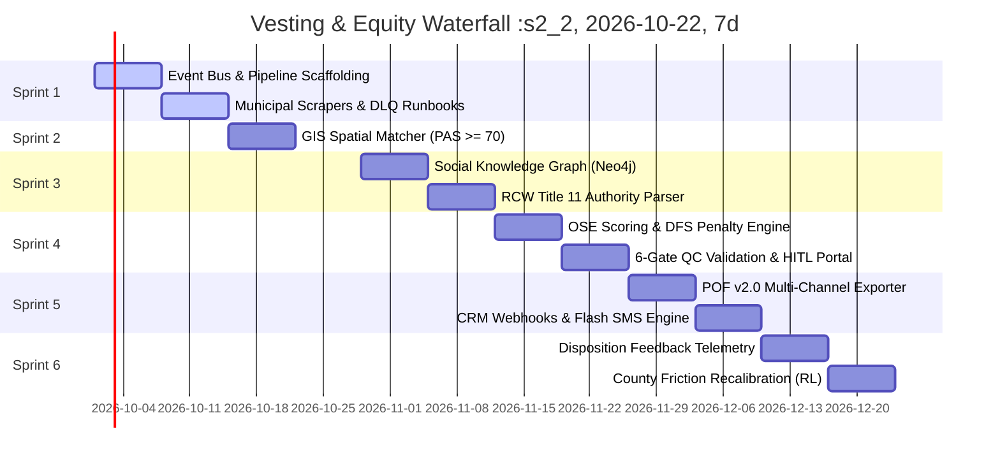

# Gieni OS — Engineering Development Sprints Roadmap
### 12-Week Agile Engineering Specification: Architecture, Epics, Tasks, & Definition of Done
**Classification: Engineering Blueprint & Sprint Backlog | Version: 2.0 | Status: Production Approved**

---

## Executive Summary & Engineering Cadence

This roadmap translates the business and architectural specifications from **Sprint 1 (Company Definition)**, **Sprint 2 (Platform Layer)**, **Sprint 3 (Product Layer)**, and **Sprint 4 (Operating System)** into a 12-week, 6-sprint engineering execution schedule:

```
┌──────────────────────────────────────────────────────────────────────────────┐
│                    GIENI OS: 6-SPRINT ENGINEERING ROADMAP                    │
├──────────────────────────────────────────────────────────────────────────────┤
│  DEV SPRINT 1 (Weeks 1-2): Event Infrastructure, Ingestion, & DLQ            │
│  DEV SPRINT 2 (Weeks 3-4): Property Identity, GIS, & Ownership Engine (OIE)  │
│  DEV SPRINT 3 (Weeks 5-6): Control Graph (CIE) & Statutory Authority (ARE)   │
│  DEV SPRINT 4 (Weeks 7-8): Scoring Engine (OSE), DFS, & 6-Gate QC Engine     │
│  DEV SPRINT 5 (Weeks 9-10): POF v2.0 Assembly, Webhooks, & Flash Dispatch   │
│  DEV SPRINT 6 (Weeks 11-12): Disposition Telemetry, RL Recalibration, & Scale│
└──────────────────────────────────────────────────────────────────────────────┘
```



---

# Dev Sprint 1: Event Infrastructure, Ingestion Pipeline, & DLQ
**Sprint Goal:** Establish the asynchronous event-driven microservice backbone, deploy headless court docket harvesters, and implement fault-tolerant dead-letter queues.

### Epic 1.1: Asynchronous Event Bus & Distributed Queue Backbone
- **Task GOS-101 [Core]:** Package `src.gieni_os.events.bus` with Redis Streams / RabbitMQ pub-sub backing.
- **Task GOS-102 [Contracts]:** Enforce strict JSON Schema / Pydantic event validation on all 10 canonical event types (`PropertyIdentifiedEvent`, `OwnershipUpdatedEvent`, etc.).
- **Task GOS-103 [Telemetry]:** Implement OpenTelemetry distributed tracing across all event handlers with correlation IDs (`trace_id`, `case_id`).
- **Acceptance Criteria:**
  - Event Bus processes $\ge 1,000$ events/second with sub-10ms delivery latency.
  - Unhandled exceptions do not crash workers and route immediately to DLQ.

### Epic 1.2: Headless Municipal Docket Harvesters
- **Task GOS-104 [Scraper]:** Build Playwright-based court scrapers targeting Pierce County LINX and King County ECR dockets.
- **Task GOS-105 [Resilience]:** Integrate residential proxy rotation with automatic exponential backoff retry.
- **Task GOS-106 [OCR]:** Connect AWS Textract / Tesseract OCR pipeline for petition PDF text extraction.
- **Acceptance Criteria:**
  - Daily scheduled ingestion runs at 06:00 AM local time with $>99.5\%$ uptime.
  - Generates immutable SHA-256 evidence hash for every ingested court filing.

### Epic 1.3: Dead-Letter Queue (DLQ) & Failure Runbooks
- **Task GOS-107 [Runbooks]:** Implement `ScraperRecoveryRunbook`, `OCRRecoveryRunbook`, `TitleConflictRunbook`, and `PartnerWebhookRecoveryRunbook`.
- **Task GOS-108 [Alerting]:** Configure PagerDuty / Slack webhook alerts when DLQ depth exceeds 5 messages.

---

# Dev Sprint 2: Property Identity, Spatial GIS, & Ownership Engine (OIE)
**Sprint Goal:** Reconcile raw court decedent names to physical GIS parcels and compute net equity waterfalls.

### Epic 2.1: Spatial GIS Resolution & APN Matching Service
- **Task GOS-201 [GIS]:** Deploy PostgreSQL + PostGIS spatial database for county parcel boundaries.
- **Task GOS-202 [PIRE]:** Implement Property Identity Resolution Engine matching decedent last-known residence against tax rolls.
- **Task GOS-203 [PAS]:** Build Parcel Attribution Score (PAS) algorithm combining street address fuzzy matching, name on title, and excise affidavits.
- **Acceptance Criteria:**
  - PAS match score $\ge 70.0$ threshold enforced before proceeding to Stage 3.
  - Automatic disqualification of cemetery plots, utility easements, and timeshares.

### Epic 2.2: Deed Vesting Chain & Encumbrance Graph
- **Task GOS-204 [Vesting]:** Programmatic classifier for Fee Simple Sole, JTWROS, Tenancy in Common, Community Property, and Living Trusts.
- **Task GOS-205 [Complexity]:** Implement Title Complexity Scoring (TCS) formula (10–100 scale).
- **Task GOS-206 [Encumbrances]:** Query County Auditor records to extract open Deeds of Trust, institutional mortgages, and reverse mortgages (HECM).
- **Acceptance Criteria:**
  - Accurately detects reverse mortgage payoffs and flags 90-day foreclosure threats.

### Epic 2.3: Net Equity Waterfall & MAO Engine
- **Task GOS-207 [Waterfall]:** Implement mathematical waterfall:
  $$\text{Net Equity} = \text{AVM} - (\sum \text{Senior Mortgages} + \text{HECM} + \text{Tax Liens} + \text{Admin Fees})$$
- **Task GOS-208 [MAO]:** Compute Maximum Allowable Offer (MAO) spread for wholesale cash assignments.

---

# Dev Sprint 3: Control Graph (CIE) & Statutory Authority (ARE)
**Sprint Goal:** Decouple title ownership from physical/family control, map social hierarchies in Neo4j, and resolve legal signatory capacity under state statutes.

### Epic 3.1: Social Dynamics & Control Intelligence Engine (CIE)
- **Task GOS-301 [Graph]:** Initialize Neo4j graph database storing `Person`, `Estate`, `Property`, and `AuthorityCandidate` nodes.
- **Task GOS-302 [Archetypes]:** Build classifier for the 5 Control Archetypes (Unified, Bifurcated, Committee, Caretaker, Absentee).
- **Task GOS-303 [Occupancy]:** Cross-reference utility disconnects, voter rolls, and mail forwarding to determine on-site occupancy.
- **Task GOS-304 [Skip-Tracing]:** Integrate multi-source identity APIs to retrieve verified mobile numbers for de-facto decision-makers.

### Epic 3.2: Washington State Statutory Authority Engine (ARE)
- **Task GOS-305 [Statutes]:** Implement Washington State RCW Title 11 rules engine:
  - RCW 11.68.011 (Nonintervention Powers verification)
  - RCW 11.28 (Letters of Administration priority)
  - RCW 11.76 (Full Court Supervision and confirmation hearing requirements)
- **Task GOS-306 [Tiers]:** Classify opportunities into 4 Evidentiary Authority Tiers (Tier 1 Certified, Tier 2 Probable, Tier 3 Non-Probate, Tier 4 Uncertain).
- **Task GOS-307 [Bypass]:** Generate fiduciary-aligned outreach scripts bypassing attorney gatekeepers.

---

# Dev Sprint 4: Opportunity Scoring Engine (OSE) & 6-Gate QC
**Sprint Goal:** Implement the composite viability formula, balance equity against deal friction, and enforce the 6-Gate Quality Control Pass.

### Epic 4.1: Opportunity Scoring & Deal Friction Calibration (OSE)
- **Task GOS-401 [Formula]:** Implement Master Scoring Formula:
  $$\text{Gross Upside} = (\text{Equity} \times 0.35) + (\text{Authority} \times 0.30) + (\text{Distress} \times 0.20) + (\text{Liquidity} \times 0.15)$$
  $$\text{Composite Score} = \text{Gross Upside} - \text{Deal Friction Score (DFS)}$$
- **Task GOS-402 [DFS Matrix]:** Implement dynamic deduction penalties (0–35 pts) based on title complexity, heir gridlock, and court oversight.
- **Task GOS-403 [Bands]:** Assign Priority Tiers: Priority A (85–100), Priority B (65–84), Priority C (50–64), Disqualified ($<50$).

### Epic 4.2: Automated 6-Gate Quality Control Pass (QCA)
- **Task GOS-404 [Gates]:** Build programmatic gate validators:
  - Gate 1: Physical Asset & Property Match ($\ge 70$ PAS)
  - Gate 2: Legal Ownership & Title Vesting
  - Gate 3: Net Equity Waterfall ($\ge \$50,000$ or $\ge 25\%$ of AVM)
  - Gate 4: Control Path & Reachable Decision-Maker
  - Gate 5: Fiduciary Authority Resolution (Tier 1, 2, or 3)
  - Gate 6: Composite Score & Friction Threshold ($\ge 50$)
- **Task GOS-405 [Notarization]:** Attach timestamped `GIENI_CERTIFIED_6_GATE_PASS` certification stamp.

### Epic 4.3: Human-in-the-Loop (HITL) Exception Portal
- **Task GOS-406 [HITL UI]:** Build web portal for intelligence analysts to review borderline opportunities scoring between 60% and 84% confidence.

---

# Dev Sprint 5: Commercial Delivery Infrastructure & POF Assembly
**Sprint Goal:** Build the 8-profile POF compiler, multi-channel dispatch layer, 4-hour flash alert engine, and print-ready PDF generator.

### Epic 5.1: 8-Profile POF Canonical Document Generator
- **Task GOS-501 [POF Builder]:** Implement `ProbateOpportunityFileBuilder` assembling all 8 canonical profiles (Property, Ownership, Control, Authority, Opportunity, Risk, Evidence, Action).
- **Task GOS-502 [Validation]:** Enforce JSON schema validation matching `pof_crm_payload.json`.

### Epic 5.2: Multi-Channel Dispatch Layer & Flash Alerts
- **Task GOS-503 [Webhooks]:** Build idempotent HTTP webhook dispatcher with exponential backoff and HMAC-SHA256 signature headers.
- **Task GOS-504 [Flash Alert]:** Deploy Twilio SMS and push alert service delivering Priority A deals in $<4$ hours.
- **Task GOS-505 [CRM Adapters]:** Build native webhook converters for Podio, GoHighLevel, Salesforce, and REI BlackBook.

### Epic 5.3: Chain-of-Custody PDF & Dossier Exporter
- **Task GOS-506 [PDF Engine]:** Integrate Playwright Chromium renderer generating executive-styled PDF deal packets with custom margins and page numbers.
- **Task GOS-507 [Notion Sync]:** Bi-directional sync with Notion Opportunities and Knowledge Base databases.

---

# Dev Sprint 6: Closed-Loop Telemetry & Multi-County Scaler
**Sprint Goal:** Ingest partner disposition feedback, calibrate county deal friction via reinforcement learning, and automate 14-day county expansion.

### Epic 6.1: Partner Disposition Telemetry Ingestion
- **Task GOS-601 [Telemetry API]:** Build REST webhook endpoint receiving disposition updates from partner CRMs:
  - First Touch Timestamp (calculates contact latency)
  - In-Person Walkthrough Booked
  - Cash Offer Presented
  - Purchase & Sale Agreement Executed
  - Escrow Closed & Wholesale Assignment Fee Realized
- **Task GOS-602 [Audit]:** Log outcome timestamps into PostgreSQL `Dispositions` table.

### Epic 6.2: Reinforcement Learning & Friction Recalibration Engine
- **Task GOS-603 [RL Model]:** Ingest historical telemetry to recalculate county friction factors and tune upstream scoring weights.
- **Task GOS-604 [Flywheel]:** Measure model accuracy gains and generate monthly partner ROI scorecards.

### Epic 6.3: Automated 14-Day County Expansion Engine
- **Task GOS-605 [Feasibility]:** Automated 5-factor feasibility scoring calculator (Population, Court Portals, Market Liquidity, State Code, Partner Anchor).
- **Task GOS-606 [Scraper Generator]:** Template generator for rapid scraper deployment across Washington's 39 counties.

---

## Engineering Definition of Done (DoD)

A user story or task is marked **DONE** only when:
1. **Unit Test Coverage:** Code achieves $\ge 85\%$ line coverage with automated pytest test suites.
2. **Contract Compliance:** All events emitted conform strictly to `src.gieni_os.events.schemas`.
3. **Integration Verification:** Passes end-to-end integration simulation via `scripts/run_production_simulation.py` with zero unhandled exceptions.
4. **Data Security & RBAC:** PII fields masked according to `SecurityPolicyEnforcer` role specifications.
5. **Documentation & Traceability:** Code contains docstrings, type hints, and updates relevant Notion/Markdown specifications.
