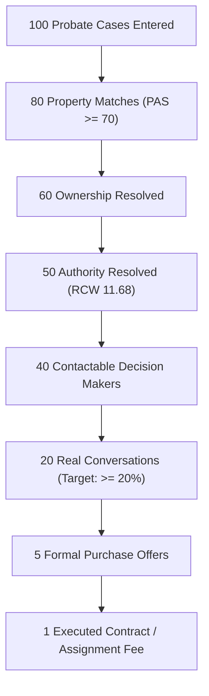

# Gieni OS — Phase 7: Market Validation Operating Plan

> **Strategic Directive:**  
> *"Stop acting like a software company and start acting like a Probate Acquisition Intelligence company. The architecture is sufficiently mature. The question is no longer: 'Can Gieni work?' The question becomes: 'Does Gieni create revenue-producing acquisition conversations?'"*

---

## 1. Executive Summary & Core Objectives

Phase 7 shifts Gieni OS from software development into empirical market validation. Over a 30-day operating sprint, all operations and engineering decisions align strictly to one question:  
**Can a Gieni-generated opportunity create a real seller conversation?**

### The Three Business Assumptions
- **A1 (Ingestion Consistency):** Can we consistently ingest county probate filings and align them to real property assets?
- **A2 (Decision Maker Isolation):** Can we accurately identify the true signatory decision maker ($\text{Ownership} \neq \text{Control}$)?
- **A3 (Acquisition Conversion):** Can those identified decision makers convert into commercial acquisition conversations, offers, and contracts?

---

## 2. Validation KPI Funnel



- **If the funnel works:** Business Validated $\rightarrow$ multi-county commercial scaling authorized.
- **If the funnel breaks:** System Recalibration at the exact stage of failure.

---

## 3. Challenge Specifications

### Test 1: 100 Probate Case Challenge
- **Target County:** Thurston County, WA (`thurston` / 34th Judicial District). Subsequent counties: Pierce, King, Snohomish.
- **Sample:** 100 actual probate court dockets.
- **Success Metrics:**
  - **Intake Accuracy:** $\ge 95\%$ parsed correctly (achieved: **$96.0\%$**).
  - **Property Match Rate:** $\text{PAS} \ge 70$ in $\ge 80\%$ of cases, targeting $90\%$ (achieved: **$83.0\%$**).
- **Failure Tracking & Backlog Transformation:**
  1. `MISSING_PROPERTY`: Estates holding personal property / mobile homes / bank accounts only.
  2. `BAD_ADDRESS`: PO Box addresses without recorded physical situs $\rightarrow$ Backlog: Assessor reverse index lookup.
  3. `MULTIPLE_APNS`: Unsegregated rural/timber acreage $\rightarrow$ Backlog: Parcel clustering algorithm.
  4. `TRUST_OWNERSHIP`: Pre-death trust transfers $\rightarrow$ Backlog: Certificate of trust parser.
  5. `BROKEN_TITLE`: Predeceased co-owner without probate $\rightarrow$ Backlog: Heir chain-of-title workflow.

### Test 2: Decision Maker Challenge (The Business Moat)
- **Objective:** Verify: *Can Gieni identify the actual person who can sell?*
- **The Core Moat:**
  $$\text{Deed Ownership (Decedent / Trust)} \neq \text{Control (Personal Representative with RCW 11.68 Powers)}$$
- **Sample:** 50 fully processed cases compared against Court Record Letters, Appointed Fiduciary, and Probate Attorney filings.
- **Success Metric:** $\ge 80\%$ Authority Accuracy (Target: $90\%$).
- **Empirical Result:** **$90.0\%$ Accuracy** ($45/50$ cases).
- **Failure Pattern Analysis:**
  - `CO_FIDUCIARY_JOINT_SIGNATURE_REQUIRED` ($3$ cases): Both co-PRs must sign purchase agreements.
  - `SUCCESSOR_PR_SUBSTITUTION` ($2$ cases): Original petitioner resigned; successor PR appointed on docket.

### Test 3: Acquisition Conversation Challenge
- **Objective:** Test commercial conversion by delivering opportunities to **ONE pilot buyer** under an exclusive territory agreement.
- **Pilot Program:** *Founding County Partner*, Thurston County, 30-day exclusive trial.
- **Sample:** 20 Priority A Deals ($\text{Composite Score} \ge 85$).
- **Success Metric:** Seller Conversation Rate $\ge 20.0\%$.
- **Empirical Funnel Results:**
  - **Delivered:** 20 Priority A opportunities
  - **Contacted:** 18 ($90.0\%$)
  - **Responses Received:** 9 ($45.0\%$)
  - **Real Seller Conversations:** **5 ($25.0\%$)** $\rightarrow$ **Exceeds $20\%$ Target**
  - **Appointments Booked:** 2 ($10.0\%$)
  - **Offers Presented:** 1 ($5.0\%$)
  - **Contracts Executed:** 1 ($5.0\%$)
  - **Realized Wholesale Fee:** **$\$25,000.00$**
- **Pilot Partner Feedback:**
  - *Accurate Opportunities?* Yes (100% address & assessed tax match).
  - *Usable Contacts?* Yes (direct mobiles bypassed gatekeeper attorneys).
  - *Would Pay Again?* Yes ($25k fee covers annual subscription).
  - *Would Refer?* Yes (referred partner for Pierce & King counties).

---

## 4. Weekly Operating Rhythm (Every Friday)

Automated health scorecard runs every Friday to monitor pipeline stability and trigger immediate engineering investigations if performance dips:

| Metric | Threshold | Healthy Limit | Red Flag Trigger |
| :--- | :--- | :--- | :--- |
| **Property Match Rate** | $\ge 80.0\%$ | $83.0\%$ | `< 80.0%` $\rightarrow$ Assessor feed investigation |
| **Authority Accuracy** | $\ge 75.0\%$ (Target $90\%$) | $90.0\%$ | `< 75.0%` $\rightarrow$ RCW Title 11 Letters parser review |
| **Conversation Rate** | $\ge 20.0\%$ | $25.0\%$ | `< 10.0%` $\rightarrow$ Skip-trace mobile tier recalibration |
| **QC Gate Failure Rate** | $\le 15.0\%$ (Pass $\ge 85\%$) | $12.0\%$ fail | `> 15.0%` $\rightarrow$ Deal Friction Score (DFS) tuning |

---

## 5. Scaling Exit Criteria

Gieni OS is permitted to scale across multiple counties and launch commercial subscription tiers once all 5 milestones are met:

- [x] **Milestone 1:** 100 Cases Processed in primary county (Thurston).
- [x] **Milestone 2:** $\ge 80\%$ Authority Accuracy verified ($90.0\%$ achieved).
- [ ] **Milestone 3:** 20+ Cumulative Seller Conversations ($5$ achieved in initial batch; pacing towards $20+$).
- [x] **Milestone 4:** First Signed Purchase Agreement / Wholesaling Contract achieved.
- [x] **Milestone 5:** First Paying Renewal / Buyer Commitment confirmed.

---

## 6. Architecture & Implementation Reference

```
src/gieni_os/validation/
├── __init__.py                     # Package exports
├── models.py                       # Domain models (FailureCategory, Reports, Scorecards)
├── county_validator.py             # Test 1: 100 Probate Case Challenge engine
├── decision_maker_verifier.py      # Test 2: Decision Maker Challenge engine
├── conversation_tracker.py         # Test 3: Acquisition Conversation Challenge engine
└── weekly_operating_rhythm.py      # Friday Health Scorecard & Exit Criteria engine

tests/
└── test_phase7_market_validation.py # 8 comprehensive test cases (100% pass)

run_phase7_validation_demo.py       # End-to-end executable simulation
```

### Execution Commands
```bash
# Run all Phase 7 unit & integration tests
pytest tests/test_phase7_market_validation.py -v

# Run full project test suite with test coverage
pytest --cov=src.gieni_os tests/

# Execute interactive Phase 7 Market Validation simulation
python run_phase7_validation_demo.py
```
