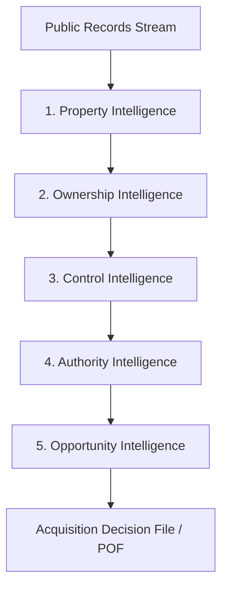
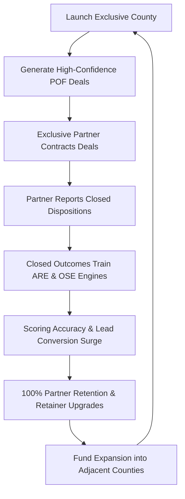

# Gieni OS — Sprint 1: Company Definition Layer
### Canonical Alignment Blueprint: Strategy, Moat, & Value Lifecycle
**Document Classification: Strategy & Corporate Architecture | Version: 2.0 | Status: Production Approved**

---

## Executive Summary & Sprint 1 Charter

```
┌──────────────────────────────────────────────────────────────────────────────┐
│                    GIENI OS: 4-SPRINT ARCHITECTURE STACK                     │
├──────────────────────────────────────────────────────────────────────────────┤
│ ▶ SPRINT 1: COMPANY DEFINITION LAYER  (Strategy, Moat, Customer Journey)     │
│   SPRINT 2: PLATFORM DEFINITION LAYER (Agents, Data Architecture, Engines)   │
│   SPRINT 3: PRODUCT DEFINITION LAYER  (POF Spec v2.0, Lifecycle, Delivery)   │
│   SPRINT 4: OPERATING COMPANY LAYER   (Automation Map, QC, SOPs, KPIs)       │
└──────────────────────────────────────────────────────────────────────────────┘
```

Sprint 1 establishes the foundational alignment layer across **Investors, Employees, Commercial Partners, and Engineering Teams**. It articulates what Gieni is, why its institutional defensibility resists commoditization, and how value deterministically flows from fragmented municipal filings into closed acquisition contracts.

```
                            THE THREE PILLARS OF SPRINT 1
    ┌──────────────────────────┬──────────────────────────┬──────────────────────────┐
    │          PAGE 1          │          PAGE 2          │          PAGE 3          │
    │     Executive System     │       Competitive        │         Customer         │
    │       Architecture       │           Moat           │         Journey          │
    │   "What is Gieni?"       │ "Why can't we be copied?"│ "How does value flow?"   │
    └──────────────────────────┴──────────────────────────┴──────────────────────────┘
```

---

# Page 1: Executive System Architecture

## 1. Mission Statement & Category Creation
> ***Gieni converts fragmented public records into acquisition-ready decisions.***

Gieni creates a new software and operational category: **Acquisition Decision Intelligence (ADI)**. 

In residential real estate, sourcing off-market transactions has historically relied on two broken archetypes:
1. **Blind Outbound Marketing:** Spray-and-pray direct mail and automated cold-calling campaigns targeted at raw, unverified lists.
2. **Commodity Court Scrapers:** Low-cost data vendors reselling raw court docket lists to dozens of competing wholesalers simultaneously.

Gieni rejects both models. Gieni does not sell data, leads, or contact records. Gieni operates as an **outsourced acquisition intelligence infrastructure**, delivering complete, pre-underwritten, county-exclusive **Probate Opportunity Files (POFs)** that tell an acquisitions team precisely:
- Which physical property possesses substantial off-market equity,
- Exactly who has the legal and de-facto power to execute a purchase contract, and
- The optimal acquisition strategy and outreach playbook required to close escrow.

```
┌─────────────────────────┐          ┌──────────────────────────┐
│   Traditional Vendors   │          │         Gieni OS         │
├─────────────────────────┤          ├──────────────────────────┤
│ • Sells raw court cases │   vs     │ • Sells verified equity  │
│ • "Lead lists" (dockets)│          │ • Decision Intelligence  │
│ • Sold to 20+ competitors│         │ • County Exclusivity     │
│ • 85%+ outreach waste   │          │ • 100% Verified Authority│
└─────────────────────────┘          └──────────────────────────┘
```

---

## 2. The Core Problems We Solve

### Problem 1: The Fragmented Ownership Problem
Generational property transfers represent the largest wealth handover in modern American history. Over 80% of distressed residential real estate tied to life events (death, divorce, incapacity, tax delinquency) passes through arcane, non-digitized, and highly fragmented public bureaucracies.

Crucially, **no single public record reveals an acquisition deal**:
- **Probate Dockets** identify estates and decedents, but rarely link physical parcels or title status.
- **County Recorders & Auditor Deeds** identify legal vestings and historical deeds, but do not record death events or heir disputes.
- **Tax Assessor Rolls** record assessed values and mailing addresses, but frequently show deceased owners decades after probate has opened.
- **Municipal Civil Courts** record creditor claims, liens, and disputes, but remain completely siloed from parcel databases.

### Problem 2: The Acquisition Decision Problem
Because municipal data is fragmented, professional acquisitions teams waste up to **90% of their payroll and marketing capital** navigating dead-ends:
- **Unverified Authority:** Reps spend weeks negotiating with a grieving child who does not hold Letters Testamentary and cannot legally convey title.
- **Negative Equity:** Reps underwrite houses only to discover senior Medicaid recovery liens, outstanding reverse mortgages, or federal tax judgments that consume all proceeds.
- **Heir Gridlock:** Contracts are signed with one sibling, only for three estranged out-of-state siblings to block the sale at the closing table.

---

## 3. The Five Intelligence Layers

Gieni resolves these structural failures through five progressive intelligence layers:



### Layer 1: Property Intelligence
- **Core Question:** *Which physical parcel exists, and is it a marketable real property asset?*
- **Operational Logic:** Maps raw estate names and decedent last-known residences against County Assessor GIS parcel layers. Filters out cemetery plots, unbuildable easements, road right-of-ways, slivers, and timeshares. Identifies residential single-family residences (SFR), multi-family (2–4 units), and redevelopment parcels.

### Layer 2: Ownership Intelligence
- **Core Question:** *Who holds legal title, and what real net equity exists?*
- **Operational Logic:** Analyzes deed vesting (Sole Ownership, Joint Tenancy with Right of Survivorship, Tenancy in Common, Living Trust, Community Property). Reconciles outstanding trust deeds, institutional mortgages, reverse mortgages (HECM), municipal tax liens, and calculates the **Net Equity Waterfall**.

### Layer 3: Control Intelligence
- **Core Question:** *Who exercises de-facto physical and emotional control over the property?*
- **Operational Logic:** Identifies physical occupancy (vacant, owner-occupied, squatter, tenant, hostile relative). Discovers the family consensus builder—the individual who may not be on the title, but who holds the physical keys and drives the emotional decision to liquidate.

### Layer 4: Authority Intelligence
- **Core Question:** *Who holds legal signatory power to execute a binding purchase and sale agreement?*
- **Operational Logic:** Examines probate docket filings, petitions, and court orders under state probate statutes (e.g., Washington RCW Title 11). Identifies whether Letters Testamentary or Letters of Administration have been granted, and determines whether the Personal Representative holds **Nonintervention Powers** (independent authority to sell without court confirmation) or **Full Court Supervision** (requiring appraisal, confirmation hearings, and 10% court overbid procedures).

### Layer 5: Opportunity Intelligence
- **Core Question:** *Is this a high-margin, actionable acquisition opportunity right now?*
- **Operational Logic:** Combines the **Net Equity Spread**, the **Deal Friction Score (DFS)**, occupancy vulnerability, and creditor notice timelines to generate a calibrated **Gieni Priority Score (0–100)** and assign actionable priority tiers (Priority A Flash, Priority B Weekly Batch, Priority C Monitor).

---

## 4. The End-to-End Processing Pipeline

```
┌──────────────────────────────────────────────────────────────────────────────┐
│                    MUNICIPAL RAW ARCHIVES (COURT / GIS / TAX)                │
└──────────────────────────────────────┬───────────────────────────────────────┘
                                       │
                                       ▼
┌──────────────────────────────────────────────────────────────────────────────┐
│  STAGE 1: RECORD EXTRACTION & NORMALIZATION                                  │
│  • Court Dockets, Auditor Deed Feeds, Assessor Rolls, Creditor Publications   │
└──────────────────────────────────────┬───────────────────────────────────────┘
                                       │
                                       ▼
┌──────────────────────────────────────────────────────────────────────────────┐
│  STAGE 2: PARCEL MATCHING & IDENTITY RESOLUTION                              │
│  • APN Resolution, Decedent-to-Title Linking, Automated GIS Verification     │
└──────────────────────────────────────┬───────────────────────────────────────┘
                                       │
                                       ▼
┌──────────────────────────────────────────────────────────────────────────────┐
│  STAGE 3: TITLE CHAIN & EQUITY WATERFALL UNDERWRITING                        │
│  • Deed Vesting Analysis, Senior Liens, Reverse Mortgages, Net Equity Spread │
└──────────────────────────────────────┬───────────────────────────────────────┘
                                       │
                                       ▼
┌──────────────────────────────────────────────────────────────────────────────┐
│  STAGE 4: STATUTORY AUTHORITY & FIDUCIARY MAPPING (RCW Title 11)             │
│  • Letters Status, Nonintervention Powers, Order of Solvency, Signatory Audit│
└──────────────────────────────────────┬───────────────────────────────────────┘
                                       │
                                       ▼
┌──────────────────────────────────────────────────────────────────────────────┐
│  STAGE 5: 6-GATE QUALITY CONTROL PASS                                        │
│  • Rejection of zero-equity, clouded title, and disqualified properties      │
└──────────────────────────────────────┬───────────────────────────────────────┘
                                       │
                                       ▼
┌──────────────────────────────────────────────────────────────────────────────┐
│  STAGE 6: COMMERCIAL MULTI-CHANNEL DELIVERY                                  │
│  • CRM Direct Webhook (JSON) | Executive Dossier (HTML) | POF Record (Notion)│
└──────────────────────────────────────────────────────────────────────────────┘
```

---

## 5. Strategic Expansion Verticals
While the MVP engine is anchored in **County Probate Intelligence**, the Gieni OS architecture is designed to expand across all fragmented ownership life events:

| Expansion Vertical | Primary Data Source | Key Friction Solved | Target Market |
| :--- | :--- | :--- | :--- |
| **Probate Estates** | Superior Court Dockets, Auditor Deeds | Fiduciary authority, heir gridlock, creditor timelines | Wholesalers, Fix & Flip, Institutional Buyers |
| **Living & Irrevocable Trusts** | Auditor Deeds, Certificate of Trust filings | Hidden successor trustees, unrecorded powers | Ultra-High-Net-Worth Buyers, Wealth Planners |
| **Heir Property / Intestacy** | Death records, Assessor tax rolls, Obituaries | Generational title clouds, unprobated intestate shares | Distressed Land & Residential Aggregators |
| **Partition Actions** | County Civil Court Dockets | Disputed co-tenancies, forced judicial liquidation | Litigation Investors, Equity Advance Funds |
| **Guardianship / Conservatorship**| Superior Court Mental Health / Guardianship | Court-approved liquidations for long-term care funding | Senior Living Relocation Funds, Cash Buyers |
| **Tax Foreclosure Distress** | County Treasurer Delinquency Rolls | Senior lien redemptions, pre-auction equity buyouts | Pre-Foreclosure Specialists, Tax Lien Investors |

---

# Page 2: Competitive Moat

## 1. The Commodity Data Trap vs. Gieni Decision Intelligence

Traditional data vendors sell raw public records as low-margin, high-churn commodities. Their business model suffers from three fatal weaknesses:

1. **Raw Scrapes Without Verification:** Traditional vendors scrape decedent names and case numbers. They do not cross-reference county deeds or assessor rolls. Over 70% of raw probate filings involve individuals who owned zero real property.
2. **Automated Skip-Tracing Dumps:** They run automated batch skip-tracing against decedent names, returning phone numbers for the deceased or disconnected landlines.
3. **The Prisoner's Dilemma of Non-Exclusivity:** Traditional vendors resell the identical CSV spreadsheet to 20 to 50 competing investors in the same county. This triggers an aggressive race to the bottom: grieving families receive 40 generic postcards and 20 offshore cold calls within 48 hours of filing, causing them to immediately hire a real estate attorney and shut out all direct buyers.

### The Five Fundamental Unknowns
When an acquisitions team purchases a traditional probate list, they receive homework, not actionable opportunities:
- **Which property matters?** Does the estate own real estate, or only an automobile and personal checking account?
- **Who owns it?** Was title held in survivorship, an LLC, or an unrecorded revocable trust?
- **Who controls the decision?** Who lives in the house and controls the keys?
- **Who has legal authority?** Who can sign a binding deed under state statute?
- **Is the contract closeable?** Will senior liens, Medicaid estate recovery, or reverse mortgages eliminate profit margins?

---

## 2. The Gieni Proprietary Intelligence Stack

Gieni replaces manual courthouse legwork with four synchronized decision engines:

```
┌──────────────────────────────────────────────────────────────────────────────┐
│                    THE GIENI 4-ENGINE INTELLIGENCE STACK                     │
├──────────────────────────────────────────────────────────────────────────────┤
│                                                                              │
│  1. OWNERSHIP INTELLIGENCE ENGINE (OIE)                                      │
│     • Reconciles real property parcels, title vestings, and encumbrances.   │
│     • Computes Title Complexity Score (10–100) & Net Equity Waterfall.       │
│                                                                              │
│  2. CONTROL INTELLIGENCE ENGINE (CIE)                                        │
│     • Isolates de-facto decision dynamics, resident caretakers, occupancy.   │
│     • Maps informal consensus leaders vs. passive heirs.                     │
│                                                                              │
│  3. AUTHORITY RESOLUTION ENGINE (ARE)                                        │
│     • Evaluates legal signatory capacity under probate statutes (RCW 11).    │
│     • Identifies Nonintervention Powers vs. Full Court Confirmation hurdles. │
│                                                                              │
│  4. OPPORTUNITY SCORING ENGINE (OSE)                                         │
│     • Synthesizes equity upside against Deal Friction Score (DFS).           │
│     • Assigns calibrated priority bands (Priority A, B, C).                  │
│                                                                              │
└──────────────────────────────────────────────────────────────────────────────┘
```

---

## 3. The Definitive Doctrine: Ownership ≠ Control ≠ Authority

The intellectual moat that prevents competitors from replicating Gieni is the mathematical and operational decoupling of **Ownership**, **Control**, and **Authority**:

```
                              THE CORE TRIAD DOCTRINE
                         
                               ┌─────────────────┐
                               │    OWNERSHIP    │
                               │  Who holds the  │
                               │   legal title?  │
                               └────────┬────────┘
                                        │
                         Does NOT equal │ Does NOT equal
                                        │
            ┌───────────────────────────┴───────────────────────────┐
            ▼                                                       ▼
  ┌───────────────────┐                                   ┌───────────────────┐
  │      CONTROL      │          Does NOT equal           │     AUTHORITY     │
  │   Who holds the   │ ◄───────────────────────────────► │   Who holds the   │
  │ physical & family │                                   │ legal signatory   │
  │    consensus?     │                                   │      power?       │
  └───────────────────┘                                   └───────────────────┘
```

### Institutional Case Studies Demonstrating the Triad:

#### Scenario A: High Authority, Zero Control
- **Fact Pattern:** An out-of-state bank fiduciary or estranged daughter is appointed Personal Representative with Nonintervention Powers (*High Authority*). However, the decedent’s adult son has lived in the house for 15 years, pays the utility bills, and refuses to allow realtors inside (*High Control*).
- **The Competitor Failure:** A traditional wholesaler contacts the daughter, signs a contract, and discovers 3 weeks later that the son refuses to vacate, requiring a 6-month court eviction that blows up escrow.
- **The Gieni Solution:** The POF identifies the resident son as the primary *Control Anchor* and provides the partner with an occupant relocation / cash-for-keys protocol to resolve possession before executing the purchase agreement with the daughter.

#### Scenario B: High Control, Zero Authority
- **Fact Pattern:** The surviving son resides in the property, maintains the lawn, and answers the phone eager to sell for cash (*High Control*). However, the decedent died intestate, five siblings are spread across the country, and no probate petition has been filed (*Zero Authority*).
- **The Competitor Failure:** The wholesaler signs a purchase agreement with the son, puts earnest money into escrow, and the title company rejects the contract because the son has no legal standing to convey title.
- **The Gieni Solution:** The POF flags the estate as *Pre-Authority*, outlines the required intestate probate administration procedure under RCW 11.28, and arms the partner with partner-attorney engagement terms to open probate and secure Letters of Administration.

---

## 4. The Gieni Flywheel of Defensibility

Gieni’s competitive advantage compounds with every county deployed:



### Flywheel Moat Factors:
1. **The Closed-Loop Disposition Advantage:** When a partner locks up a contract or closes escrow, they log the transaction into Gieni’s Dispositions database. Gieni learns which title profiles, family dynamics, and debt spreads convert into cash closings. Pure software scrapers that do not operate an exclusive partner channel never receive disposition feedback and cannot train predictive models.
2. **Territorial Exclusivity Covenant:** By guaranteeing only **one operator per county**, Gieni creates an aligned partner who willingly shares revenue outcomes, title roadblocks, and local court quirks.
3. **Proprietary Court Docket Parsers:** Scraping county dockets requires custom microservices tailored to each county’s proprietary systems (e.g., Pierce County LINX, King County ECR). Once built and integrated with GIS parcel boundaries, the technical barrier to entry for generic scrapers is insurmountable.

---

# Page 3: Customer Journey

## 1. Ideal Customer Profile (ICP) & Disqualification Criteria

Gieni does not sell subscriptions to the public. We partner with only **one elite operator per territory**.

```
┌───────────────────────────────────────┬───────────────────────────────────────┐
│     QUALIFIED PARTNER PROFILE (ICP)   │     DISQUALIFIED BUYER PROFILES       │
├───────────────────────────────────────┼───────────────────────────────────────┤
│ • Active Wholesaler / Acquisitions    │ • Retail Real Estate Agents / Brokers │
│ • Closes 2–10+ off-market deals/month │ • Passive "Buy-and-Hold" Hobbyists    │
│ • Dedicated inbound/outbound reps     │ • Solo operators without phone time   │
│ • Established escrow & title partners │ • Direct mail spray-and-pray shops    │
│ • Capacity to contact leads in 24-48h │ • Operators unwilling to report data  │
└───────────────────────────────────────┴───────────────────────────────────────┘
```

---

## 2. The 11-Stage End-to-End Journey Map


### Detailed Stage Breakdown

#### Stage 1: Awareness (Problem Recognition)
- **Customer Reality:** Operator is spending $5,000–$15,000/month on generic direct mail, cold-calling lists, and offshore VAs. Response rates are under 1%, acquisitions reps are demoralized by gatekeeper attorneys, and competitors are calling the same leads.
- **Gieni Action:** Publish executive case studies demonstrating the difference between commodity probate lists and verified *Acquisition Decision Intelligence*.
- **Primary Metric:** Inbound Strategy Call Requests from Tier-1 Wholesalers.

#### Stage 2: Sales Discovery & County Availability
- **Customer Objective:** Secure a protected territory and eliminate local competition on probate deals.
- **Gieni Objective:** Audit prospect acquisitions infrastructure, verify deal close volume, and verify target county availability.
- **Gate:** If the requested county is already locked under an exclusive contract, the prospect is placed on the **Territory Waitlist**.

#### Stage 3: County Historical Volume Audit
- **Customer Objective:** Understand exact deal capacity and realistic revenue upside in their market.
- **Gieni Objective:** Run a backfilled 90-day municipal audit of the target county to calculate:
  - Total probate cases filed,
  - Percentage linking to single-family residential (SFR) real property,
  - Percentage granted Nonintervention Powers vs. Full Court Supervision,
  - High-equity qualified opportunity run-rate.
- **Deliverable:** Executive County Audit Dossier.

#### Stage 4: Proposal (Founding Partner Terms)
- **Gieni Offer:**
  - **Setup Fee:** $2,000 one-time onboarding, CRM integration, and buy-box calibration fee.
  - **Monthly Retainer:** $3,000/month (e.g., County Launch Tier: 30–40 high-confidence POF files/month).
  - **Exclusivity Covenant:** 100% territorial lock for 90 days. No other investor receives Gieni files in the county.
- **Commitment:** Operator agrees to contact all delivered Priority A opportunities within 48 hours and log outcome dispositions bi-weekly.

#### Stage 5: Contract Execution
- **Deliverable:** Fully executed *County Exclusive Probate Intelligence Agreement*.
- **Key Clauses:** Exclusivity Guarantee, Delivery SLAs (file count and gate verification), Confidentiality, and Dispositions Reporting Requirement.

#### Stage 6: Technical Onboarding & Calibration (Days 1–7)
- **Integration:** Configure real-time CRM webhook endpoints (Podio, GoHighLevel, Salesforce, REI BlackBook) to receive `pof_crm_payload.json`.
- **Calibration:** Fine-tune the Opportunity Scoring Engine (OSE) to match the partner's exact buy-box (e.g., minimum equity spread >$100,000; excluded flood zones; specific zip codes).
- **Rep Training:** Provide acquisitions reps with Gieni's *Authority-First Outreach Playbook* (bypassing gatekeepers, addressing fiduciary duty, handling resident caretakers).

#### Stage 7: Weekly Opportunity Delivery (Days 8–90)
- **Rhythm:**
  - **Weekly Batch Drops:** Every Tuesday morning, 8–12 fully vetted POF files delivered directly into partner CRM.
  - **Priority A Flash Alerts:** Instant delivery within 4 hours when an urgent, high-equity filing with Nonintervention Powers is docketed.
- **Format:** High-resolution PDF executive deal packets + automated CRM record creation.

#### Stage 8: Dispositions Tracking & Pipeline Motion
- **Partner Action:** Reps execute targeted outreach using Gieni's verified decision-maker contact dossiers and script angles.
- **Feedback Loop:** Partner logs stage progression into Gieni CRM:
  - Meaningful Contact Made $\rightarrow$ In-Person Appointment Set $\rightarrow$ Cash Offer Submitted $\rightarrow$ Purchase Contract Signed $\rightarrow$ Escrow Closed.

#### Stage 9: Monthly Executive Performance Review (Days 30 & 60)
- **Collaborative Review:** Gieni Account Director reviews partner metrics:
  - Contact Rate (Target: >35%),
  - Appointment Rate (Target: >15% of contacts),
  - Offer Rate (Target: >50% of appointments),
  - Title Roadblock Rate (Target: <5%).
- **Engine Tuning:** Refine scoring weights if particular neighborhoods or encumbrance profiles underperform.

#### Stage 10: 90-Day MVP Validation & Renewal
- **Objective:** Convert the 90-day pilot into a 12-month recurring territorial contract.
- **The Proof Package:** Gieni compiles the **90-Day County Performance Dossier**:
  - Total POF files delivered vs. committed SLA,
  - Partner pipeline value generated,
  - Executed contracts and closed wholesale assignment fees.
- **Renewal Terms:**
  - **County Growth Tier:** $4,500/month (expanded filing capacity + pre-probate death notice feeds).
  - **Annual Commitment:** 12-month exclusive lock with quarterly volume reviews.

#### Stage 11: Multi-County Portfolio Expansion
- **Objective:** Scale high-performing partners into regional powerhouses across contiguous counties.
- **Execution:** Partner locks 2 to 5 neighboring counties under identical institutional SLAs, establishing a regional acquisition moat.

---

## 3. The Customer Milestone & Metric Scorecard

| Journey Stage | Primary Customer KPI | Target Benchmark | Failure Alarm Trigger |
| :--- | :--- | :--- | :--- |
| **Onboarding** | CRM Webhook Ping Latency | < 500 ms | Webhook payload parse error |
| **Delivery** | Weekly Opportunity SLA | 100% of committed tier | < 90% tier delivery in any 14-day window |
| **Outreach** | Contact Rate on Priority A Files | > 40% within 5 days | Partner rep failing to dial within 72h |
| **Conversion** | Appointment / Inspection Rate | > 15% of reached heirs | Reps using generic retail real estate pitches |
| **Escrow** | Closing Ratio on Underwritten Deals | > 80% of contracts | Undetected title liens stalling closing |
| **Renewal** | Partner 90-Day Renewal Rate | > 85% | Inadequate partner sales capacity |

---

## Summary of Sprint 1 Alignment

Sprint 1 definitively answers the fundamental questions of the enterprise:
1. **What is Gieni?** An Acquisition Decision Intelligence Platform that converts public records into verified, off-market real estate acquisition contracts.
2. **Why can't someone copy us?** Our proprietary decoupling of *Ownership ≠ Control ≠ Authority*, synchronized 4-engine stack, closed-loop partner disposition feedback, and territorial exclusivity covenant create an insurmountable operational moat.
3. **How does value flow?** Through an institutional 11-stage customer journey that turns elite single-county operators into multi-year, high-margin enterprise partners.
