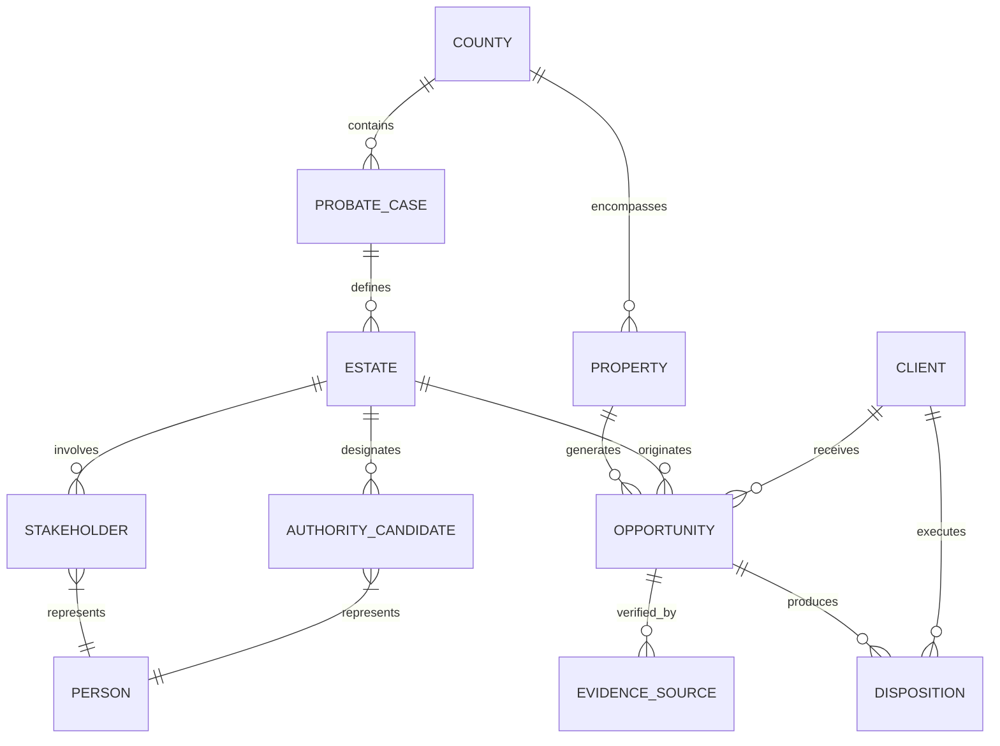

# Gieni OS — Sprint 2: Platform Definition Layer
### Technical Architecture: Autonomous Microservices, Relational Schema, & Intelligence Engines
**Document Classification: Engineering Specification & System Architecture | Version: 2.0 | Status: Production Approved**

---

## Executive Summary & Sprint 2 Charter

```
┌──────────────────────────────────────────────────────────────────────────────┐
│                    GIENI OS: 4-SPRINT ARCHITECTURE STACK                     │
├──────────────────────────────────────────────────────────────────────────────┤
│   SPRINT 1: COMPANY DEFINITION LAYER  (Strategy, Moat, Customer Journey)     │
│ ▶ SPRINT 2: PLATFORM DEFINITION LAYER (Agents, Data Architecture, Engines)   │
│   SPRINT 3: PRODUCT DEFINITION LAYER  (POF Spec v2.0, Lifecycle, Delivery)   │
│   SPRINT 4: OPERATING COMPANY LAYER   (Automation Map, QC, SOPs, KPIs)       │
└──────────────────────────────────────────────────────────────────────────────┘
```

Sprint 2 specifies the internal mechanics of the **Gieni Platform**:
1. **Agent Architecture & Orchestration:** The Directed Acyclic Graph (DAG) of 9 autonomous microservices coordinated by the Master Orchestrator.
2. **Relational Data Architecture:** The complete relational data model across 12 core entities, primary/foreign keys, and data contracts.
3. **The 4 Intelligence Engines:** Comprehensive technical breakdowns of the Ownership Intelligence Engine (OIE), Control Intelligence Engine (CIE), Authority Resolution Engine (ARE), and Opportunity Scoring Engine (OSE).

---

# Page 4: Agent Architecture & Autonomous Orchestration

## 1. The Autonomous DAG Execution Model

Gieni operates as an event-driven, directed acyclic graph (DAG) of **nine specialized autonomous agents** managed by the **Master Orchestrator**. The orchestrator enforces strict data contracts, manages asynchronous event queues, and routes edge cases to human-in-the-loop (HITL) review queues whenever confidence scores breach minimal thresholds.

```mermaid
graph TD
    Ingest[Municipal Data Stream] --> MO[Master Orchestrator]
    MO --> AG1[1. Property Identity Agent]
    AG1 --> AG2[2. Parcel Reconciliation Agent]
    AG2 --> AG3[3. Ownership Intelligence Agent]
    AG3 --> AG4[4. Control Intelligence Agent]
    AG3 --> AG5[5. Authority Resolution Agent]
    AG4 --> AG6[6. Opportunity Scoring Agent]
    AG5 --> AG6
    AG6 --> AG7[7. Quality Control Agent]
    AG7 -->|Pass (Confidence >= 85%)| AG8[8. Commercial Reporting Agent]
    AG7 -->|Fail / Disqualified| Sink[Dead-Lead Quarantine]
    AG7 -->|Review Exception (60-84%)| HITL[Human Review Queue]
    HITL -->|Approved| AG8
    AG8 --> Ext[External CRM Webhooks & PDFs]
    Ext --> AG9[9. Feedback & Outcomes Agent]
    AG9 -->|Tuning Signals| AG6
```

---

## 2. Specification of the 9 Autonomous Agents

### Agent 1: Property Identity Agent (PIA)
- **Primary Function:** Ingests raw decedent, petitioner, and estate names from county court filings, obituaries, and death certificates, querying municipal tax assessor rolls and deed registries to discover all associated physical parcels.
- **Inputs:** Decedent Full Name, Date of Death, Last Known Address, County Docket ID.
- **Outputs:** Candidate Parcel APN List, Property Physical Address, Legal Description, Assessed Land/Improvement Values.
- **Failure Modes & HITL Triggers:** Name ambiguity (common names like "John Smith"), out-of-county properties, corporate owner entity on deed. Triggers HITL when parcel confidence < 80%.

### Agent 2: Parcel Reconciliation Agent (PRA)
- **Primary Function:** Verifies that discovered parcels represent genuine real property assets owned by the decedent at the time of death, eliminating false positives (e.g., properties sold prior to death, road easements, cemetery plots, timeshares).
- **Inputs:** Candidate Parcel APN List, County Auditor Historical Recording Index, Excise Tax Affidavits.
- **Outputs:** Reconciled Active Parcel Record, Most Recent Deed Recording Number, GIS Centroid Coordinates, Zoning / Land Use Code.
- **Failure Modes & HITL Triggers:** Active foreclosure notices (Lis Pendens), tax auction flags, unrecorded contract-for-deed transactions.

### Agent 3: Ownership Intelligence Agent (OIA)
- **Primary Function:** Analyzes the deed vesting chain to determine legal title structure, outstanding encumbrances, and the net equity waterfall.
- **Inputs:** Reconciled Parcel Record, County Auditor Grantor/Grantee Index, Open Mortgage / Deed of Trust Filings, Statutory Liens.
- **Outputs:** Title Vesting Classification (Fee Simple Sole, JTWROS, Tenancy in Common, Living Trust), Title Complexity Score (10–100), Estimated Net Equity ($).
- **Failure Modes & HITL Triggers:** Outstanding Reverse Mortgages (HECM), senior Medicaid Estate Recovery liens, unreleased ancestral probate clouds. Triggers HITL if net equity < $50,000.

### Agent 4: Control Intelligence Agent (CIA)
- **Primary Function:** Separates legal title from de-facto decision power by identifying the actual family consensus driver, occupant status, and physical property custody.
- **Inputs:** Probate Petition Heir Schedules, Voter Registration Records, Utility Billing Payee Records, Occupancy Cross-References.
- **Outputs:** Control Archetype (Unified, Bifurcated, Committee, Caretaker, Absentee), De-Facto Decision-Maker Profile, Occupancy Status (Vacant, Owner-Occupied, Tenant, Squatter), Resident Caretaker Flag.
- **Failure Modes & HITL Triggers:** Contested petitions, hostile occupant relatives, competing petitions for administration.

### Agent 5: Authority Resolution Agent (ARA)
- **Primary Function:** Maps the legal signatory pathway under state probate statutes (e.g., Washington State RCW Title 11), determining whether personal representatives hold independent power of sale.
- **Inputs:** County Docket Documents (Petition for Probate, Order Appointing Personal Representative, Letters Testamentary/Administration, Oath, Will Text).
- **Outputs:** Authority Classification Tier (Tier 1 Certified, Tier 2 Probable, Tier 3 Non-Probate, Tier 4 Uncertain), Nonintervention Powers Flag (True/False), Court Oversight Status (Independent vs. Full Court Supervision).
- **Failure Modes & HITL Triggers:** Will contests, bond requirements not met, dependent administration requiring court confirmation hearings and 10% overbid procedures.

### Agent 6: Opportunity Scoring Agent (OSA)
- **Primary Function:** Synthesizes equity upside against the Deal Friction Score (DFS) to assign a definitive composite score (0–100) and actionable priority tier.
- **Inputs:** Net Equity ($), Title Complexity Score, Control Model, Authority Tier, Creditor Notice Expiration Date.
- **Outputs:** Composite Opportunity Score (0–100), Priority Tier (Priority A Flash Alert, Priority B Weekly Batch, Priority C Monitor), Recommended Acquisition Strategy (Wholesale Cash, Novation, Equity Advance, Probate Buyout).
- **Master Formula:**
  $$\text{Gross Upside} = (\text{Equity} \times 0.35) + (\text{Authority} \times 0.30) + (\text{Distress} \times 0.20) + (\text{Liquidity} \times 0.15)$$
  $$\text{Composite Score} = \text{Gross Upside} - \text{Deal Friction Score (DFS)}$$

### Agent 7: Quality Control Agent (QCA)
- **Primary Function:** Enforces the **6-Gate Quality Control Pass**. Prevents disqualified or low-confidence records from reaching commercial partner pipelines.
- **Inputs:** Fully synthesized candidate POF record.
- **Outputs:** QC Certification Stamp (`GIENI_CERTIFIED_6_GATE_PASS`), Rejection Audit Reason, or Review Exception routing.
- **Operational Rule:** An opportunity must score $\ge 85\%$ confidence across all 6 gates to pass automatically. Scores between $60\%$ and $84\%$ are routed to human review; scores $< 60\%$ are quarantined.

### Agent 8: Reporting & Delivery Agent (RDA)
- **Primary Function:** Formats validated opportunities into multi-channel commercial deliverables: CRM JSON Webhooks, high-resolution HTML/PDF Executive Dossiers, and Notion database synchronizations.
- **Inputs:** Certified POF record.
- **Outputs:** `pof_crm_payload.json`, `pof_executive_dossier.html`, PDF deal packets, Notion live page creation.

### Agent 9: Feedback & Outcomes Agent (FOA)
- **Primary Function:** Ingests partner disposition updates (contact timestamps, appointment outcomes, offer amounts, title roadblocks, escrow closings) to recalibrate scoring weights and friction penalties across upstream agents.
- **Inputs:** Dispositions Database records, webhook status updates from partner CRMs.
- **Outputs:** Friction penalty adjustment vectors, county velocity metrics, partner conversion scorecards.

---

# Page 5: Relational Data Architecture

## 1. Core Entity Relational Diagram (ERD)



---

## 2. The 12 Core Relational Entities

### 1. `County`
- **Primary Key:** `county_fips` (String, e.g., `"53053"`)
- **Fields:** `county_name` (String), `state` (String), `court_system_type` (Enum: `LINX`, `ODYSSEY`, `ECR`, `TYLER`), `scraping_cadence` (Enum: `DAILY`, `HOURLY`), `exclusivity_status` (Enum: `AVAILABLE`, `LOCKED_FOUNDING`, `LOCKED_GROWTH`), `active_partner_id` (FK $\rightarrow$ `Client`).

### 2. `Probate_Case`
- **Primary Key:** `case_id` (String, e.g., `"WA-PC-2026-00892"`)
- **Fields:** `county_fips` (FK), `docket_number` (String), `filing_date` (Date), `case_status` (Enum: `OPEN`, `CLOSED`, `CONTESTED`, `SUPERVISED`), `decedent_person_id` (FK $\rightarrow$ `Person`), `case_type` (Enum: `TESTATE`, `INTESTATE`, `TRUST_ESTATE`).

### 3. `Property`
- **Primary Key:** `property_id` (UUID)
- **Fields:** `apn` (String), `county_fips` (FK), `street_address` (String), `city` (String), `zip_code` (String), `property_type` (Enum: `SFR`, `DUPLEX`, `TRIPLEX`, `FOURPLEX`, `VACANT_LAND`), `assessed_value` (Decimal), `avm_value` (Decimal), `gis_lat` (Float), `gis_lng` (Float), `zoning_code` (String).

### 4. `Person`
- **Primary Key:** `person_id` (UUID)
- **Fields:** `first_name` (String), `last_name` (String), `middle_name` (String), `date_of_death` (Date, Nullable), `phone_primary` (String), `phone_status` (Enum: `VERIFIED`, `UNKNOWN`, `DISCONNECTED`), `mailing_address` (String), `ssn_last4` (String, Encrypted).

### 5. `Stakeholder`
- **Primary Key:** `stakeholder_id` (UUID)
- **Fields:** `estate_id` (FK), `person_id` (FK), `relationship_to_decedent` (Enum: `SURVIVING_SPOUSE`, `CHILD`, `SIBLING`, `CREDITOR`, `ATTORNEY`), `claim_percentage` (Decimal), `sentiment_archetype` (Enum: `COOPERATIVE`, `HOSTILE`, `PASSIVE`, `UNREACHABLE`).

### 6. `Trust` (Non-Probate Entity)
- **Primary Key:** `trust_id` (UUID)
- **Fields:** `trust_name` (String), `formation_date` (Date), `revocability` (Enum: `REVOCABLE`, `IRREVOCABLE`), `current_trustee_id` (FK $\rightarrow$ `Person`), `certificate_recording_num` (String).

### 7. `Estate`
- **Primary Key:** `estate_id` (UUID)
- **Fields:** `probate_case_id` (FK), `gross_inventory_value` (Decimal), `insolvency_risk` (Boolean), `creditor_claim_deadline` (Date), `court_oversight_level` (Enum: `NONINTERVENTION`, `SUPERVISED`, `SUMMARY`).

### 8. `Authority_Candidate`
- **Primary Key:** `candidate_id` (UUID)
- **Fields:** `estate_id` (FK), `person_id` (FK), `authority_role` (Enum: `EXECUTOR`, `ADMINISTRATOR`, `SUCCESSOR_TRUSTEE`, `HEIR_APPARENT`), `letters_issued` (Boolean), `letters_issue_date` (Date), `powers_granted` (String), `statutory_source` (String, e.g., `"RCW 11.68.011"`).

### 9. `Opportunity`
- **Primary Key:** `opportunity_id` (String, e.g., `"OPP-2026-PC-505"`)
- **Fields:** `property_id` (FK), `estate_id` (FK), `authority_candidate_id` (FK), `composite_score` (Integer 0–100), `priority_tier` (Enum: `PRIORITY_A_FLASH`, `PRIORITY_B_WEEKLY`, `PRIORITY_C_MONITOR`), `net_equity_spread` (Decimal), `deal_friction_score` (Integer 0–35), `assigned_partner_id` (FK $\rightarrow$ `Client`), `qc_pass_date` (DateTime).

### 10. `Evidence_Source`
- **Primary Key:** `evidence_id` (UUID)
- **Fields:** `opportunity_id` (FK), `source_type` (Enum: `COURT_DOCKET`, `AUDITOR_DEED`, `ASSESSOR_GIS`, `CREDITOR_NOTICE`, `AVM_FEED`), `source_reference_id` (String, e.g., `"AUD-200608220199"`), `verification_hash` (SHA-256), `extracted_timestamp` (DateTime).

### 11. `Client` (Commercial Partner)
- **Primary Key:** `client_id` (UUID)
- **Fields:** `company_name` (String), `primary_contact` (String), `partner_tier` (Enum: `FOUNDING_PARTNER`, `GROWTH_PARTNER`, `ENTERPRISE`), `assigned_county_fips` (String), `webhook_url` (String), `monthly_file_allocation` (Integer), `exclusivity_expiry` (Date).

### 12. `Disposition`
- **Primary Key:** `disposition_id` (UUID)
- **Fields:** `opportunity_id` (FK), `client_id` (FK), `disposition_stage` (Enum: `DELIVERED`, `CONTACT_MADE`, `APPOINTMENT_SET`, `OFFER_SUBMITTED`, `CONTRACT_SIGNED`, `CLOSED_WON`, `CLOSED_LOST`), `wholesale_fee` (Decimal, Nullable), `days_to_contact` (Integer), `loss_reason` (Enum: `TITLE_ROADBLOCK`, `HEIR_DISPUTE`, `OVERPRICED`, `COMPETITOR_BEAT`, Nullable).

---

# The Four Intelligence Engines: Deep-Dive

## Engine 1: Ownership Intelligence Engine (OIE)

The OIE converts raw property searches into verified legal ownership pathways. It executes five submodules:

```
┌──────────────────────────────────────────────────────────────────────────────┐
│                    OIE: FIVE PROGRESSIVE SUBMODULES                          │
├──────────────────────────────────────────────────────────────────────────────┤
│ 1. Property Identity Resolution Engine (PIRE) -> Multi-parcel discovery      │
│ 2. Parcel Reconciliation Engine (PRE)        -> Asset attribution & GIS match│
│ 3. OIE Core Title & Vesting Engine           -> Deed vesting & complexity    │
│ 4. Control Pathway Decoupler                 -> Decouples Title from Control │
│ 5. Equity Intelligence Engine (EIE)          -> Net Equity Waterfall audit   │
└──────────────────────────────────────────────────────────────────────────────┘
```

### Title Complexity Scoring Matrix (10–100)
The OIE computes a **Title Complexity Score (TCS)** based on encumbrances and title chain friction:
- **Base Score: 10 pts** (Clean Fee Simple Sole Ownership, single recorded deed).
- **Additions:**
  - `+15 pts`: Community Property or Surviving Spouse without recorded survivorship affidavit.
  - `+25 pts`: Tenancy in Common across 2 or more deceased owners.
  - `+30 pts`: Unreleased institutional Deed of Trust $>15$ years old without satisfaction.
  - `+40 pts`: Outstanding Reverse Mortgage (HECM) requiring immediate cure or payoff.
  - `+50 pts`: Active Municipal/IRS Tax Lien or Medicaid Estate Recovery Notice.

### The Net Equity Waterfall Calculation:
$$\text{Net Equity} = \text{AVM Fair Market Value} - \left(\sum \text{Mortgages} + \text{HECM Payoff} + \text{Tax Liens} + \text{Probate Statutory Fees}\right)$$

---

## Engine 2: Control Intelligence Engine (CIE)

The CIE models human family dynamics and occupancy friction, mapping opportunities into five structural control models:

```
┌──────────────────────────────────────────────────────────────────────────────┐
│                     THE FIVE CIE CONTROL ARCHETYPES                          │
├──────────────────────────────────────────────────────────────────────────────┤
│ Model 1: Unified Fiduciary Control (Executor = Sole Heir = Resident)         │
│          -> Action: Immediate direct cash offer to Fiduciary.                │
│ Model 2: Bifurcated Authority / Control (Out-of-state Exec vs. Local Heir)    │
│          -> Action: Address resident heir needs first; execute with Exec.    │
│ Model 3: Sibling Consensus Committee (Co-Executors / Multi-Heir Gridlock)     │
│          -> Action: Structure deal with formal buyout agreement for all.     │
│ Model 4: Hostile Resident Caretaker (Squatter / Estranged Relative in House) │
│          -> Action: Include cash-for-keys / relocation escrow clause.        │
│ Model 5: Absentee Estate (Vacant Property, Distant Fiduciary)                 │
│          -> Action: Pitch expedited closing with zero cleanup required.       │
└──────────────────────────────────────────────────────────────────────────────┘
```

---

## Engine 3: Authority Resolution Engine (ARE)

The ARE decodes legal signatory power under state probate statutory codes (specifically modeled after **Washington State RCW Title 11**):

### The 4-Tier Evidentiary Authority Matrix
- **Tier 1: Court Certified (Signatory Confirmed)**
  - *Evidentiary Standard:* Court docket shows issued Letters Testamentary or Letters of Administration with **Nonintervention Powers** under RCW 11.68. Personal Representative has unconstrained signatory capacity to convey deed without court confirmation hearings.
- **Tier 2: Probable Fiduciary (Petition Pending)**
  - *Evidentiary Standard:* Will filed naming Personal Representative, petition docketed, hearing scheduled within 14 days. Letters imminent.
- **Tier 3: Non-Probate / Trust Pathway**
  - *Evidentiary Standard:* Real property held in Living Trust or JTWROS deed. Disposition authority belongs to Successor Trustee or surviving joint tenant by operation of law.
- **Tier 4: Uncertain / Unprobated (High Friction)**
  - *Evidentiary Standard:* Intestate death without petition, or estate subject to **Full Court Supervision** (RCW 11.76) requiring formal appraisal, publication, confirmation hearing, and court overbid procedures.

### The Gatekeeper Bypass Protocol
Generic investors call the attorney listed on the court docket, who promptly blocks communication. Gieni’s ARE extracts the personal contact information for the **appointed Personal Representative directly**, providing partner reps with fiduciary-aligned conversation scripts that bypass legal gatekeepers while respecting ethical standards.

---

## Engine 4: Opportunity Scoring Engine (OSE)

The OSE prevents acquisitions teams from falling into "high equity / high friction" traps by deducting points for execution friction:

### Deal Friction Score (DFS) Penalties (0–35 Points)
- **DFS Low (0–5 pts):** Clean fee simple, Tier 1 Certified Authority, sole fiduciary, vacant property.
- **DFS Medium (6–15 pts):** Living trust transfer, uncontested petition pending, resident cooperative heir.
- **DFS High (16–25 pts):** Reverse mortgage payoff deadline within 90 days, 2–3 sibling co-heirs, supervised administration.
- **DFS Fatal (26–35 pts):** Contested will, hostile squatter in possession, Medicaid estate recovery claim exceeding 60% of equity.

### Actionable Priority Bands
| Priority Band | Composite Score | Guaranteed Partner SLA | Delivery Mechanism |
| :--- | :---: | :--- | :--- |
| **Priority A (Flash)** | **85 – 100** | Direct outreach within **4 hours** | Instant CRM Webhook Push + SMS Alert |
| **Priority B (Batch)** | **65 – 84** | Standard outreach within **48 hours** | Weekly Tuesday Batch Drop (PDF Dossier) |
| **Priority C (Monitor)** | **50 – 64** | Automated docket monitoring | Re-scores when Letters/Orders are filed |
| **Disqualified** | **< 50** | Rejected at Gate 6 | Quarantined; never delivered to partner |

---

## Summary of Sprint 2 Platform Specifications

Sprint 2 establishes the core engineering standard for Gieni:
- **Autonomous Directed Acyclic Graph:** 9 specialized agents coordinate to process municipal data deterministically.
- **Institutional Relational Data Schema:** 12 relational entities capture all real estate, fiduciary, legal, and financial data points.
- **The 4-Engine Stack:** Mathematical rigor balances equity upside against statutory court friction to deliver unmatched off-market deal conversion.
