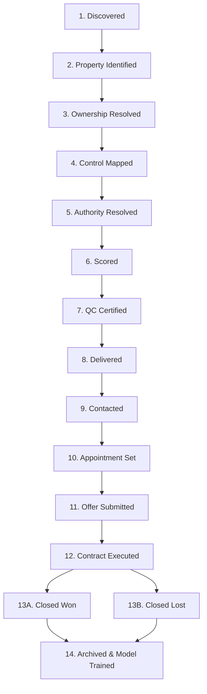

# Gieni OS — Sprint 3: Product Definition Layer
### Commercial Specification: The Probate Opportunity File (POF v2.0), Lifecycle State Machine, & Multi-Channel Delivery
**Document Classification: Commercial Deliverable & Product Architecture | Version: 2.0 | Status: Production Approved**

---

## Executive Summary & Sprint 3 Charter

```
┌──────────────────────────────────────────────────────────────────────────────┐
│                    GIENI OS: 4-SPRINT ARCHITECTURE STACK                     │
├──────────────────────────────────────────────────────────────────────────────┤
│   SPRINT 1: COMPANY DEFINITION LAYER  (Strategy, Moat, Customer Journey)     │
│   SPRINT 2: PLATFORM DEFINITION LAYER (Agents, Data Architecture, Engines)   │
│ ▶ SPRINT 3: PRODUCT DEFINITION LAYER  (POF Spec v2.0, Lifecycle, Delivery)   │
│   SPRINT 4: OPERATING COMPANY LAYER   (Automation Map, QC, SOPs, KPIs)       │
└──────────────────────────────────────────────────────────────────────────────┘
```

Sprint 3 defines the exact commercial product Gieni manufactures, sells, and delivers:
1. **The Probate Opportunity File (POF v2.0):** The 8-profile canonical product specification, data contract, JSON schema, and executive print format.
2. **The Opportunity Lifecycle Engine (OLE):** The 14-stage deterministic state machine governing pipeline progression, entry/exit criteria, and SLA time gates.
3. **The Client Delivery Workflow:** Multi-channel dispatch infrastructure, Priority A flash alerts, and closed-loop disposition telemetry.

---

# Page 6: Probate Opportunity File (POF v2.0) Specification

## 1. Product Overview: The Commercial Deliverable

The **Probate Opportunity File (POF)** is an exclusive, pre-underwritten decision dossier that provides an acquisitions team with immediate operational clarity. It replaces raw lead lists with eight synchronized profiles:

```
┌───────────────────────────────────────────────────────────────────────────┐
│                     PROBATE OPPORTUNITY FILE (POF)                        │
├───────────────────────────────────────────────────────────────────────────┤
│ 1. PROPERTY PROFILE    APN, Address, Legal Bounds, AVM Valuation, GIS Cent│
│ 2. OWNERSHIP PROFILE   Deed Vesting, Historical Chain, Mortgages, Net Eq  │
│ 3. CONTROL PROFILE     De-Facto Decision-Maker, Occupancy, Social Archetyp│
│ 4. AUTHORITY PROFILE   Letters Status, Power of Sale Scope, Court Oversight│
│ 5. OPPORTUNITY PROFILE Composite Score (0-100), Priority Tier, SLA Window │
│ 6. RISK PROFILE        Title Clouds, Foreclosure, Heirs Dispute, MERP Liens│
│ 7. EVIDENCE PACKAGE    Immutable SHA-256 Court Petitions, Wills, Deeds    │
│ 8. RECOMMENDED ACTION  First-Touch Script Angle, Empathy Playbook, Escrow  │
└───────────────────────────────────────────────────────────────────────────┘
```

---

## 2. The Eight Canonical Product Profiles

### 1. Property Profile
- **APN / PIN:** County Assessor Parcel Number & GIS boundary coordinates.
- **Situs Address:** USPS CASS-certified standard physical address.
- **Legal Description:** Lot, Block, Subdivision / Metes & Bounds recording.
- **Physical Specs:** Property Class (SFR, Multi-Family 2–4, Vacant Land), Heated Living Area (SqFt), Bed/Bath count, Lot Acreage, Year Built.
- **Valuation Spread:** Assessed Value (Land vs. Improvements), Automated Valuation Model (AVM) Fair Market Baseline, Comparative Market Analysis (CMA) spread.
- **Condition Signals:** Municipal code enforcement violations, utility disconnect alerts, structural tax flags.
- **Parcel Attribution Score (PAS):** 0–100 match confidence (delivery threshold $\ge 70$).

### 2. Ownership Profile
- **Legal Title Vesting:** Sole Fee Simple, Joint Tenancy with Right of Survivorship (JTWROS), Tenancy in Common, Community Property, or Living Trust.
- **Title Complexity Score (TCS):** 10–100 rating reflecting chain-of-title hurdles.
- **Deed History Chain:** Date, Instrument Number, Grantor, Grantee, Document Type (Statutory Warranty Deed, Quitclaim, Personal Representative Deed).
- **Senior Encumbrances:** Active institutional deeds of trust, open mortgage balances, reverse mortgage (HECM) balances, statutory tax liens, HOA judgments.
- **Net Equity Waterfall:** Gross AVM Value minus Senior Mortgages, Liens, and Statutory Administration Fees.

### 3. Control Profile
- **De-Facto Decision-Maker:** Primary family consensus driver, verified mobile contact, physical location, and relationship to decedent.
- **Occupancy Status:** Vacant (Unsecured/Secured), Owner-Occupied, Tenant-Occupied, Squatter/Adverse Possessor.
- **CIE Control Model:** Unified Fiduciary, Bifurcated Authority/Control, Sibling Consensus Committee, Hostile Resident Caretaker, Absentee Estate.
- **Resident Caretaker Flag:** Boolean flag indicating whether an heir resides on-site requiring an occupant relocation agreement.

### 4. Authority Profile
- **Evidentiary Authority Tier:** Tier 1 Court Certified, Tier 2 Probable Fiduciary, Tier 3 Non-Probate/Trust, Tier 4 Uncertain.
- **Letters Status:** Issued Letters Testamentary, Letters of Administration, or Pending Petition.
- **Statutory Authority Scope (RCW Title 11):** Nonintervention Powers granted under RCW 11.68 (unsupervised sale power) vs. Full Court Supervision under RCW 11.76 (appraisal, confirmation hearing, 10% overbid risk).
- **Fiduciary Appointee:** Full Name, Address, Contact, Attorney of Record (for ethical notice compliance).

### 5. Opportunity Profile
- **Gieni Composite Score:** 0–100 calibrated priority ranking.
- **Priority Tier:** Priority A (Flash Alert), Priority B (Weekly Batch), Priority C (Docket Monitor).
- **Deal Velocity SLA:** Recommended first contact window (Priority A: $<4$ hours; Priority B: $<48$ hours).
- **Estimated Net Wholesale Spread:** Modeled investor spread based on 70% of AVM minus repairs and encumbrances.

### 6. Risk Profile
- **Deal Friction Score (DFS):** 0–35 deduction penalty based on title and family friction.
- **Foreclosure & Auction Flags:** Active Notice of Default (NOD), Lis Pendens, or scheduled Trustee Sale date.
- **Medicaid Estate Recovery (MERP):** DSHS/Medicaid lien exposure and recovery claim estimates.
- **Heir Gridlock Probability:** Probability of multi-heir title clouds or unlocated intestate heirs.

### 7. Evidence Package
- **Immutable Verification Hashes:** SHA-256 cryptographic hashes for every source docket, deed recording, and assessor roll.
- **Source Hyperlinks:** Direct links to Pierce County LINX docket, Pierce County Auditor Deed search, and Assessor-Treasurer parcel maps.
- **Quality Control Certification:** Timestamped QC Certification Stamp (`GIENI_CERTIFIED_6_GATE_PASS`) and reviewing agent signature.

### 8. Recommended Actions
- **Primary Acquisition Strategy:** Wholesale Cash Assignment, Novation Agreement, Probate Advance Buyout, or Subject-To Wrap.
- **First-Touch Script Angle:** Empathy-first outreach framing tailored to the specific control model (e.g., Fiduciary Burden Relief vs. Caretaker Relocation Support).
- **Escrow Title Checklist:** Specific title curative documents required for closing (Order of Solvency, Nonintervention Decree, Lack of Probate Affidavit).

---

## 3. Commercial Delivery Data Contract (`pof_crm_payload.json`)

```json
{
  "opportunity_id": "OPP-2026-PC-POF-01",
  "county": "Pierce County, WA",
  "county_fips": "53053",
  "qc_status": "GIENI_CERTIFIED_6_GATE_PASS",
  "timestamp": "2026-09-19T11:04:00Z",
  "property_profile": {
    "apn": "0321151042",
    "situs_address": "3719 N 28TH ST, TACOMA, WA 98407",
    "legal_description": "SECTION 15 TOWNSHIP 21 RANGE 03 QUARTER 12 SEMPLE 2ND L 1 THRU 4 B 7",
    "property_class": "SFR",
    "sqft": 2140,
    "bedrooms": 3,
    "bathrooms": 2.0,
    "year_built": 1948,
    "avm_market_value": 585000.0,
    "assessed_value": 542100.0,
    "parcel_attribution_score": 98.4
  },
  "ownership_profile": {
    "vesting": "Fee Simple (Estate of Marilyn Albright Keller)",
    "title_complexity_score": 15,
    "recorded_deed_instrument": "AUD-200608220199",
    "open_mortgages_balance": 112000.0,
    "hecm_reverse_mortgage": false,
    "tax_delinquency_balance": 0.0,
    "estimated_net_equity": 473000.0
  },
  "control_profile": {
    "control_model": "Model 1: Unified Fiduciary Control",
    "primary_decision_maker": "David Keller",
    "relationship_to_decedent": "Son / Personal Representative",
    "contact_phone": "253-555-0192",
    "contact_status": "VERIFIED_MOBILE",
    "occupancy_status": "Vacant (Secured by Executor)",
    "resident_caretaker_present": false
  },
  "authority_profile": {
    "authority_tier": "Tier 1: Court Certified",
    "case_docket_number": "26-4-00389-1",
    "letters_status": "Letters Testamentary Issued",
    "statutory_powers": "RCW 11.68 Nonintervention Powers Granted",
    "court_oversight": "Independent Administration (No Confirmation Required)",
    "fiduciary_name": "David Keller"
  },
  "opportunity_profile": {
    "composite_score": 92,
    "priority_tier": "Priority A: Flash Alert",
    "deal_friction_score": 4,
    "recommended_strategy": "Wholesale Cash Assignment",
    "sla_outreach_window_hours": 4
  },
  "risk_profile": {
    "foreclosure_active": false,
    "merp_medicaid_lien": false,
    "heir_dispute_detected": false,
    "title_risk_summary": "Clean single deed chain; nonintervention decree entered."
  }
}
```

---

# Page 7: Opportunity Lifecycle Engine (OLE)

## 1. The 14-Stage Lifecycle State Machine

An acquisition deal is not a static list entry; it is a dynamic legal transaction. The **Opportunity Lifecycle Engine (OLE)** manages deterministic state transitions:



---

## 2. Stage-by-Stage Entry, Exit, & Automation Rules

| Stage | Name | Entry Gate | Exit Criteria | Automated Action |
| :---: | :--- | :--- | :--- | :--- |
| **01** | **Discovered** | Scraper extracts valid docket from court portal. | Invariant SHA-256 hash generated; docket created. | Dispatches Property Identity Agent (PIA). |
| **02** | **Property Identified**| Discovered case has decedent full name & address. | Parcel Attribution Score (PAS) $\ge 70$. | Dispatches Parcel Reconciliation Agent (PRA). |
| **03** | **Ownership Resolved** | Reconciled APN confirmed in County Assessor roll. | Deed vesting classified; Net Equity computed. | Dispatches OIE Core & Encumbrance Engine. |
| **04** | **Control Mapped** | Estate record initialized with heir schedule. | Decision-maker identified; Occupancy confirmed. | Dispatches Control Intelligence Agent (CIA). |
| **05** | **Authority Resolved**| Probate petition docketed in Superior Court. | Signatory capacity verified (RCW Title 11 Tier). | Dispatches Authority Resolution Agent (ARA). |
| **06** | **Scored** | Upstream profiles (OIE, CIE, ARE) complete. | Composite score (0–100) & DFS (0–35) generated. | Dispatches Opportunity Scoring Agent (OSA). |
| **07** | **QC Certified** | Composite Score $\ge 50$. | 6-Gate Pass criteria met; Hash stamped. | Dispatches Quality Control Agent (QCA). |
| **08** | **Delivered** | Opportunity certified with QC Stamp. | Webhook acknowledged (HTTP 200) by partner CRM. | Syncs PDF Dossier & triggers partner SMS alert. |
| **09** | **Contacted** | Delivered to exclusive partner CRM. | Rep logs outbound phone touch or verified email. | Initiates partner 5-day contact SLA timer. |
| **10** | **Appointment Set** | Decision-maker engages in meaningful dialogue. | Property inspection / cash offer meeting booked. | Telemetry event logged; alerts Gieni Director. |
| **11** | **Offer Submitted** | Inspection completed; repair budget finalized. | Formal purchase and sale agreement presented. | Telemetry logs offer spread vs. AVM baseline. |
| **12** | **Contract Executed**| Seller signs binding purchase agreement. | Title and escrow opened; earnest money deposited. | Telemetry locks deal; flags closing deadline. |
| **13A**| **Closed Won** | Escrow disburses funds; deed recorded. | Partner logs wholesale assignment fee / close. | FOA updates county win weights & flywheel. |
| **13B**| **Closed Lost** | Deal cancelled prior to closing. | Reason code assigned (Title, Overpriced, Heir). | FOA logs friction factor to penalize future models. |
| **14** | **Archived** | Escrow closed or deal terminated. | All historical logs locked; training weights stored. | Permanent compliance archive commit. |

---

# Page 8: Client Delivery Workflow

## 1. Multi-Channel Dispatch Infrastructure

Opportunities are delivered through four specialized channels, engineered to match the partner's operational workflow:

```
                      CERTIFIED PROBATE OPPORTUNITY
                      (Passed Quality Control Gate)
                                   │
            ┌──────────────────────┴──────────────────────┐
            ▼                                             ▼
   [Priority A Trigger?]                         [Standard Priority B/C]
            │                                             │
      YES   ▼                                             ▼
  ┌─────────────────────────┐                   ┌─────────────────────────┐
  │ FLASH ALERT ENGINE      │                   │ WEEKLY BATCH STAGING    │
  │ Latency: < 4 Hours      │                   │ Tuesday 08:00 AM Local  │
  └─────────┬───────────────┘                   └─────────┬───────────────┘
            │                                             │
            └──────────────────────┬──────────────────────┘
                                   ▼
                  ┌─────────────────────────────────┐
                  │ MULTI-CHANNEL DISPATCH LAYER    │
                  ├─────────────────────────────────┤
                  │ 1. Partner CRM Direct Webhook   │
                  │ 2. Encrypted SMS / Email Flash  │
                  │ 3. Notion OS Operating Database │
                  │ 4. PDF Chain-of-Custody Dossier │
                  └────────────────┬────────────────┘
                                   ▼
                  ┌─────────────────────────────────┐
                  │ DISPOSITION TELEMETRY FEEDBACK  │
                  │ (Contact → Appt → Offer → Close)│
                  └─────────────────────────────────┘
```

---

## 2. Dispatch Channels & SLAs

### Channel 1: Scheduled Weekly Batch Drops
- **Schedule:** Every Tuesday at 08:00 AM Local Territory Time.
- **Contents:** 8 to 12 fully underwritten, pre-screened POF deal packets representing all Priority B filings qualified during the prior 7 days.
- **Formats:** Bulk JSON push into partner CRM + direct download link to PDF executive deal dossiers.

### Channel 2: Priority A Flash Alert Engine
- **Trigger:** Any filing that scores $\ge 85$ with Tier 1 Court Certified Authority, clean Fee Simple ownership, and net equity spread $>\$150,000$.
- **SLA Delivery Speed:** Pushed to partner within **4 hours** of municipal court docketing.
- **Alert Mechanism:** Webhook event triggers high-priority task in partner CRM + instant SMS alert to partner Acquisitions Director:
  > *"🚨 GIENI FLASH ALERT: Priority A Probate Opportunity in Tacoma (3719 N 28TH ST). $473k Net Equity, Letters Testamentary Issued w/ Nonintervention Powers. Sole Fiduciary David Keller. Dossier synced to CRM."*

### Channel 3: CRM Direct Webhook Payload
- **Compatibility:** Direct, native JSON payloads mapped for Podio, GoHighLevel, Salesforce, REI BlackBook, and HubSpot.
- **Data Integrity:** Idempotent webhooks with retry backoff and HMAC-SHA256 signature headers to guarantee zero duplicate lead records.

### Channel 4: Chain-of-Custody PDF Dossiers
- **Design:** Institutional-grade, print-ready PDFs formatted for acquisitions reps conducting field inspections or executive review. Includes title deed stamps, parcel maps, and probate letters transcripts.

---

## 3. The Closed-Loop Disposition Telemetry Engine

To power the Gieni Flywheel, partner CRMs send automated status callbacks back to Gieni as deals progress through four key milestones:
1. **Milestone 1: First Meaningful Contact** (Captured within 48h; measures decision-maker reachability).
2. **Milestone 2: Appointment Inspection** (Captured within 7 days; measures script conversion).
3. **Milestone 3: Offer Presentation** (Captured within 14 days; measures valuation alignment).
4. **Milestone 4: Contract Escrow Closing** (Captured at closing; records wholesale assignment spread).

### SLA Compliance Scorecard
Partners who fail to initiate outreach on Priority A opportunities within 72 hours receive an automated **Capacity Alert**. Consistent failure to work delivered files results in territory exclusivity revocation under Section 4.2 of the Founding Partner Agreement.

---

## Summary of Sprint 3 Product Specifications

Sprint 3 establishes the commercial deliverable that separates Gieni from all commodity data products:
- **The 8-Profile POF:** A complete, institutional decision dossier that provides equity, title, control, and authority in a single document.
- **14-Stage OLE State Machine:** Rigorous entry/exit criteria prevent corrupted records from ever reaching partners.
- **Multi-Channel Delivery Infrastructure:** Real-time webhooks, 4-hour flash alerts, and disposition feedback loops create an unbroken commercial bridge between municipal courts and closed wholesale contracts.
