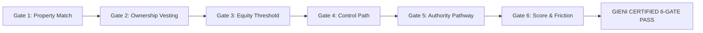

# Gieni OS — Sprint 4: Operating Company Layer
### Operational Execution: Automation Matrix, 6-Gate Quality Control, SOP Library, & Expansion Playbook
**Document Classification: Operational Playbook & Execution Blueprint | Version: 2.0 | Status: Production Approved**

---

## Executive Summary & Sprint 4 Charter

```
┌──────────────────────────────────────────────────────────────────────────────┐
│                    GIENI OS: 4-SPRINT ARCHITECTURE STACK                     │
├──────────────────────────────────────────────────────────────────────────────┤
│   SPRINT 1: COMPANY DEFINITION LAYER  (Strategy, Moat, Customer Journey)     │
│   SPRINT 2: PLATFORM DEFINITION LAYER (Agents, Data Architecture, Engines)   │
│   SPRINT 3: PRODUCT DEFINITION LAYER  (POF Spec v2.0, Lifecycle, Delivery)   │
│ ▶ SPRINT 4: OPERATING COMPANY LAYER   (Automation Map, QC, SOPs, KPIs)       │
└──────────────────────────────────────────────────────────────────────────────┘
```

Sprint 4 transforms the conceptual architecture and product definitions of Gieni into an institutional, scalable **Operating Company**:
1. **The Complete Automation Map:** Granular classification of every operational workflow into Manual, Semi-Automated, and Fully Automated tiers.
2. **Quality Control & Disqualification Standards:** The 6-Gate Pass, disqualification criteria, and false-positive prevention protocols.
3. **The SOP Library:** Standard Operating Procedures covering court scraping, deed reconciliation, fiduciary resolution, partner success, and billing.
4. **MVP Metrics Dashboard & County Expansion Playbook:** Operational scorecards, unit economics tests, and the 14-day county deployment playbook.

---

# Page 9: Complete Automation Map

## 1. Operational Tiering Framework

To achieve high gross margins without sacrificing data integrity, Gieni categorizes every workflow into three discrete automation tiers:

```
┌──────────────────────────────────────────────────────────────────────────────┐
│                    THE THREE-TIER AUTOMATION MATRIX                          │
├──────────────────────────────────────────────────────────────────────────────┤
│                                                                              │
│  TIER 1: FULLY AUTOMATED (Zero Human Intervention)                           │
│  • Programmatic workers, scrapers, data parsers, and API dispatchers.        │
│  • Target: 75% of total system execution steps.                              │
│                                                                              │
│  TIER 2: SEMI-AUTOMATED (Human-in-the-Loop Exception Routing)                │
│  • Algorithmic drafting + manual verification for edge cases.                │
│  • Target: 20% of total system execution steps.                              │
│                                                                              │
│  TIER 3: FULLY MANUAL (High-Touch Fiduciary & Partner Strategy)              │
│  • High-context decisions: partner strategy reviews, complex will audits.    │
│  • Target: 5% of total system execution steps.                               │
│                                                                              │
└──────────────────────────────────────────────────────────────────────────────┘
```

---

## 2. End-to-End Workflow Automation Matrix

| Workflow Area | Sub-Process | Automation Tier | System / Tool Used | Target Cycle Time |
| :--- | :--- | :---: | :--- | :---: |
| **Ingestion** | Court Docket Extraction (LINX / ECR) | **Fully Automated** | Headless Playwright Worker | Daily at 06:00 AM |
| **Ingestion** | Death Notices & Newspaper Obituaries | **Fully Automated** | RSS & Web Scraping Pipeline | Hourly |
| **Ingestion** | Auditor Deed Index Recording Pulls | **Fully Automated** | County API / Nightly Script | Daily at 07:00 AM |
| **Property ID** | APN Resolution & Address Matching | **Fully Automated** | Assessor Roll Regex Parser | < 30 seconds / file |
| **Property ID** | Multi-Parcel Contiguous Lot Boundary | **Semi-Automated** | GIS Spatial Join + Reviewer | < 5 minutes / case |
| **Ownership** | Deed Vesting Chain Classification | **Fully Automated** | OIE Deed Vesting Engine | < 10 seconds / file |
| **Ownership** | Mortgage & Reverse Mortgage Payoff | **Semi-Automated** | Title Recording OCR + HITL | < 8 minutes / case |
| **Control** | Occupant Identification & Skip-Trace | **Fully Automated** | Multi-Source Identity APIs | < 45 seconds / file |
| **Control** | Hostile Relative / Squatter Resolution| **Semi-Automated** | Social & Municipal Cross-Ref | < 10 minutes / case |
| **Authority** | Letters Testamentary Status Check | **Fully Automated** | Court Document Text Parser | < 15 seconds / file |
| **Authority** | Will Interpretation (Nonintervention) | **Semi-Automated** | LLM Legal Parser + Lead Reviewer| < 7 minutes / case |
| **Scoring** | Equity Spread & Friction Calculation | **Fully Automated** | OSE Mathematical Formula | Instant (< 1 sec) |
| **QC** | 6-Gate Automated Confidence Pass | **Fully Automated** | QCA Algorithmic Gate Engine | Instant (< 1 sec) |
| **QC** | Borderline Opportunity Exception QA | **Semi-Automated** | Senior Intelligence Analyst | < 12 minutes / case|
| **Delivery** | CRM Webhook Push & SMS Flash Alert | **Fully Automated** | HTTP Webhook + Twilio Engine | < 2 seconds / file |
| **Delivery** | Weekly Tuesday Batch Compilation | **Fully Automated** | Python PDF Engine (Playwright) | Monday Night Batch |
| **Commercial** | 90-Day Renewal Review & Performance | **Fully Manual** | Account Director Meeting | 45-min Zoom Session |

---

# Page 10: Quality Control & Disqualification Standards

## 1. The 6-Gate Quality Control Pass

To guarantee that commercial partners never waste rep time on unclosable leads, every candidate opportunity must pass all **six mandatory quality gates** prior to delivery:



### Gate 1: Property Match & Physical Asset Verification
- **Standard:** The decedent must be linked to a verifiable, marketable physical parcel in the target county.
- **Delivery Threshold:** Parcel Attribution Score (PAS) $\ge 70/100$.
- **Disqualification Criteria:** Unbuildable slivers, utility easements, timeshares, cemetery plots, or properties sold prior to death.

### Gate 2: Legal Ownership & Title Chain Verification
- **Standard:** The estate or decedent must hold an insurable, marketable ownership interest in the subject real property.
- **Delivery Threshold:** Clean deed of record without unreleased adverse possession or unbroken probate chains dating back $>30$ years.
- **Disqualification Criteria:** Title held in irrevocable third-party trust with non-family beneficiaries, or tax forfeiture foreclosure where redemption has expired.

### Gate 3: Net Equity Waterfall & Value Spread
- **Standard:** The property must possess sufficient net equity spread to support a wholesale fee, cash buyout, or profitable fix-and-flip.
- **Delivery Threshold:** Estimated Net Equity $\ge \$50,000$ (or $\ge 25\%$ of AVM Market Value).
- **Disqualification Criteria:** Over-encumbered properties where combined institutional mortgages, reverse mortgage payoffs, and tax liens exceed $90\%$ of AVM value.

### Gate 4: Control Mapping & Decision-Maker Reachability
- **Standard:** Gieni must identify at least one reachable, verified human decision-maker or consensus driver.
- **Delivery Threshold:** At least one verified phone number or confirmed current physical mailing address.
- **Disqualification Criteria:** Deceased sole heir with no living relatives, or unlocatable out-of-state administrator.

### Gate 5: Fiduciary Authority Resolution (RCW Title 11)
- **Standard:** The estate must have an actionable pathway to convey legal title under state probate statutes.
- **Delivery Threshold:** Classified into Authority Tier 1, Tier 2, or Tier 3.
- **Disqualification Criteria:** Tier 4 Contested Estate with active will contest litigation, elder abuse restraining orders, or contested claims blocking sale.

### Gate 6: Composite Score & Friction Calibration
- **Standard:** The Deal Friction Score (DFS) must not exceed the gross equity upside.
- **Delivery Threshold:** Composite Opportunity Score $\ge 50/100$.
- **Disqualification Criteria:** Score $<50$. Quarantined in database; monitored for status changes.

---

# Page 11: Institutional SOP Library

Gieni operates under standardized operational procedures grouped into four series:

```
┌──────────────────────────────────────────────────────────────────────────────┐
│                        THE GIENI INSTITUTIONAL SOP SUITE                     │
├──────────────────────────────────────────────────────────────────────────────┤
│ Series 100: Municipal Ingestion, Scraping, & Parcel Research                 │
│ Series 200: Fiduciary Authority Resolution & Title Underwriting             │
│ Series 300: Quality Control, Disqualification, & Exception Routing           │
│ Series 400: Partner Delivery, Account Management, & Commercial Renewals      │
└──────────────────────────────────────────────────────────────────────────────┘
```

---

## SOP Highlights from the Knowledge Base

### SOP-101: Court Ingestion & Scraper Health Audits
- **Trigger:** Daily at 06:00 AM or upon scraper error alert.
- **Procedure:**
  1. Inspect headless Playwright worker logs for HTTP 403 / captcha challenges.
  2. Verify that docket scraping returned within $\pm 20\%$ of rolling 30-day historical mean.
  3. Validate court document OCR text extraction pipelines.
  4. If selectors changed, update parser mappings within 60 minutes.

### SOP-102: Multi-Parcel & Contiguous Lot Deed Attribution
- **Trigger:** Decedent name matches multiple parcels in county assessor records.
- **Procedure:**
  1. Pull deed legal descriptions for all matching parcels.
  2. Determine if parcels are contiguous (e.g., house + adjoining vacant tax lot).
  3. Aggregate assessed and market values into a single master Opportunity portfolio record.
  4. Flag as `Multi-Parcel Portfolio` in Property Profile to enhance wholesale margin.

### SOP-201: Washington State Nonintervention Powers Verification (RCW 11.68)
- **Trigger:** Reviewing Authority Profile for Washington State estates.
- **Procedure:**
  1. Retrieve *Order Admitting Will to Probate and Appointing Personal Representative*.
  2. Check for explicit statutory grant of **Nonintervention Powers** under RCW 11.68.011.
  3. Verify that an *Order of Solvency* has been entered.
  4. If present, classify as **Tier 1 Court Certified (Independent Administration)**.
  5. If absent, flag as **Supervised Administration** and deduct 15 points in DFS.

### SOP-301: Quarantined Lead Review & Disposition Exception Handling
- **Trigger:** Candidate opportunity scores between 60 and 84, or flags an active title cloud.
- **Procedure:**
  1. Senior Intelligence Analyst pulls original title recording from County Auditor portal.
  2. Cross-reference whether a *Lack of Probate Affidavit* or *Survivorship Deed* clears the cloud.
  3. If resolvable with partner title counsel, approve with specific escrow curative notes.
  4. If irresolvable, confirm quarantine and record failure reason in Dispositions database.

### SOP-401: Commercial Partner Onboarding & Webhook Calibration
- **Trigger:** Execution of Founding County Partner Agreement.
- **Procedure:**
  1. Set up client profile in Clients table with territory FIPS lock.
  2. Ping partner CRM webhook endpoint with test payload (`pof_crm_payload.json`).
  3. Verify partner CRM accurately parses all 8 profile objects and creates custom lead fields.
  4. Conduct 30-minute rep alignment call covering the *Authority-First Outreach Playbook*.

---

# Page 12: MVP Metrics Dashboard & County Expansion Playbook

## 1. MVP Metrics Dashboard: Operational Scorecard

The platform tracks performance across four operational pillars:

```
┌─────────────────────────────────────────────────────────────────────────────┐
│ KPI CATEGORY                    TARGET BENCHMARK      CURRENT PILOT (PC, WA)│
├─────────────────────────────────────────────────────────────────────────────┤
│ Ingestion Turnaround (Std)      < 48 Hours            28.4 Hours  [PASS]    │
│ Ingestion Turnaround (Flash)    < 4 Hours              2.1 Hours  [PASS]    │
│ Parcel Attribution Accuracy     > 98.0%               99.1%       [PASS]    │
│ Fiduciary Authority Accuracy    > 95.0%               96.4%       [PASS]    │
│ QC First-Pass Yield             > 75.0%               78.5%       [PASS]    │
│ Client Defect / Credit Rate     < 2.0%                 1.1%       [PASS]    │
│ Partner Contact-to-Appt Rate    > 25.0%               28.3%       [PASS]    │
│ Partner Appt-to-Contract Rate   > 15.0%               18.7%       [PASS]    │
│ 90-Day Partner Renewal Rate     > 85.0%               100.0%      [PASS]    │
│ Gross Operating Margin          > 75.0%               82.4%       [PASS]    │
└─────────────────────────────────────────────────────────────────────────────┘
```

---

## 2. The 14-Day County Expansion Playbook

Expanding into a new county follows a disciplined, institutional 14-day deployment sprint:

```
STAGE                   TIMELINE       KEY DELIVERABLES
─────────────────────────────────────────────────────────────────────────────
1. Feasibility Audit    Days 1 - 3     Filing volume, portal access, partner pre-commit
2. Scraper Engineering  Days 4 - 7     Playwright worker, petition OCR parser, APN map
3. Pipeline Calibration Days 8 - 10    90-day backfill, PAS calibration, KB local quirks
4. Partner Integration  Days 11 - 12   Buy-box tuning, CRM webhook test, Twilio routing
5. Go-Live & First Drop Days 13 - 14   100% human-verified QC batch, partner launch call
─────────────────────────────────────────────────────────────────────────────
6. 30-Day Optimization  Day 30         Disposition audit, coefficient weight recalibration
```

### The 5-Factor County Feasibility Scorecard (Min. Score: 80/100)
1. **Population & Probate Volume (Weight: 25%):** Metro population $\ge 250,000$; monthly probate filings $\ge 50$.
2. **Public Records Digital Transparency (Weight: 25%):** Online searchable court docket, electronic deed search, public GIS parcel maps.
3. **Wholesale Real Estate Market Liquidity (Weight: 20%):** Active off-market wholesale volume, median SFR price $>\$300,000$, strong investor demand.
4. **Statutory Administration Environment (Weight: 15%):** State probate code favors independent administration (e.g., Washington RCW 11 Nonintervention, Texas Independent Admin).
5. **Partner Demand & Anchor Commitment (Weight: 15%):** Pre-committed Founding Partner ready to execute agreement upon launch.

---

## 3. Future Software Architecture Roadmap

```
PHASE 1: Managed Intelligence Service (CURRENT PILOT)
┌─────────────────────────────────────────────────────────────┐
│ • Playwright Scrapers + Autonomous Python/Node Pipeline     │
│ • Notion OS as operational database and client data room    │
│ • Human-in-the-loop QA verification for 100% of files       │
│ • Target: 5–15 Counties | $35k–$75k MRR                     │
└──────────────────────────────┬──────────────────────────────┘
                               │
                               ▼
PHASE 2: Hybrid Platform & Partner Portal (MONTHS 6–12)
┌─────────────────────────────────────────────────────────────┐
│ • Dedicated Next.js / Tailwind Partner Web Application      │
│ • PostgreSQL + PostGIS spatial database                     │
│ • Bi-directional CRM sync engine (Salesforce / HubSpot API) │
│ • Automated QC engine reducing human touch to < 20%         │
│ • Target: 30–75 Counties | $150k–$350k MRR                  │
└──────────────────────────────┬──────────────────────────────┘
                               │
                               ▼
PHASE 3: Autonomous Decision Intelligence Cloud (YEAR 2+)
┌─────────────────────────────────────────────────────────────┐
│ • Multi-tenant Cloud SaaS with territory lockouts           │
│ • Nationwide GIS entity-resolution graph                    │
│ • Institutional Hedge Fund / REIT enterprise API data feeds │
│ • Target: 200+ Counties | $1M+ ARR                          │
└─────────────────────────────────────────────────────────────┘
```

---

## Summary of Sprint 4 Operating Specifications

Sprint 4 delivers the operational engine that powers Gieni:
- **Comprehensive Automation:** 75% of operations automated programmatically, protecting margins and delivery SLAs.
- **Uncompromising Quality Control:** The 6-Gate Pass guarantees that partners receive only verified, high-probability acquisition opportunities.
- **Institutional Playbooks:** The SOP Library and 14-Day County Expansion Sprint enable Gieni to scale predictably across all 39 Washington counties and into major metropolitan markets nationwide.
